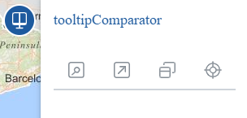
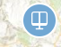

<p align="center">
  
</p>
<h1 align="center"><strong>API IDEE</strong> <small>🔌 IDEE.plugin.Comparators</small></h1>


## Descripción 👷

Plugin que agrupa los diversos plugins comparadores en una misma herramienta.

|  Herramienta abierta  |Herramienta cerrada
|:----:|:----:|
|||


Los modos de comparación son: Cortina, "spy eye" y modo espejo.

## Dependencias 👷

Para que el plugin funcione correctamente es necesario importar las siguientes dependencias en el documento html:
Para uso de implementación OpenLayers:
- **comparators.ol.min.js**
- **comparators.ol.min.css**

Para uso de implementación Cesium:
- **comparators.cesium.min.js**
- **comparators.cesium.min.css**


```html
 <link href="https://componentes.idee.es/api-idee/plugins/comparators/comparators.ol.min.css" rel="stylesheet" />
 <script type="text/javascript" src="https://componentes.idee.es/api-idee/plugins/comparators/comparators.ol.min.js"></script>
```

# Uso del histórico de versiones

Existe un histórico de versiones de todos los plugins de API-IDEE en [api-idee-legacy](https://github.com/Desarrollos-IDEE/API-IDEE/tree/master/api-idee-legacy/plugins) para hacer uso de versiones anteriores.
Ejemplo:
```html
 <link href="https://componentes.idee.es/api-idee/plugins/comparators/comparators-1.0.0.ol.min.css" rel="stylesheet" />
 <script type="text/javascript" src="https://componentes.idee.es/api-idee/plugins/comparators/comparators-1.0.0.ol.min.js"></script>
```


## Modos de comparación

**Comparador de espejo / mirrorpanelParams**: permite comparar varias capas dividiendo la pantalla en varias partes. Los mapas tienen sus vistas sincronizadas, y podemos ver la representación de una misma zona por distintas capas.

**Comparador de cortina / lyrcompareParams**: permite comparar varias capas sobre una cartografía base. La extensión de las capas sobre lienzo vienen definidas por la posición del ratón o por el punto medio del lienzo.

**Comparador zonal / transparencyParams**: reducción de la capa comparativa a una zona circular para contratarla con el mapa de fondo.

## Parámetros

El constructor se inicializa con un JSON de options con los siguientes atributos:

- **position**: Indica la posición donde se mostrará el plugin.
  - 'TL': (top left) - Arriba a la izquierda.
  - 'TR': (top right) - Arriba a la derecha (por defecto).
  - 'BL': (bottom left) - Abajo a la izquierda.
  - 'BR': (bottom right) - Abajo a la derecha.

- **collapsed**: Indica si el plugin viene colapsado de entrada (true/false). Por defecto: true.

- **collapsible**: Indica si el plugin puede abrirse y cerrarse (true) o si permanece siempre abierto (false). Por defecto: true.

- **enabledDisplayInLayerSwitcher**: Define si se incluirán en el selector de capas las capas con displayInLayerSwitcher *true*.

- **listLayers**: Array de capas (String o Object), estas capas se verán en el selector (WMS o WMTS).
```JavaScript
// Ejemplos de definiciones de capas esperadas por el
// comparador en formato StringLayer

/* WMS */
[
  'WMS*Huellas Sentinel2*https://wms-satelites-historicos.idee.es/satelites-historicos*teselas_sentinel2_espanna*true',
  'WMS*Invierno 2022 falso color natural*https://wms-satelites-historicos.idee.es/satelites-historicos*SENTINEL.2022invierno_432-1184*true',
  'WMS*Invierno 2022 falso color infrarrojo*https://wms-satelites-historicos.idee.es/satelites-historicos*SENTINEL.2022invierno_843*true',
  'WMS*Filomena*https://wms-satelites-historicos.idee.es/satelites-historicos*Filomena*true',
]

 /* WMTS */
[
  'WMTS*https://www.ign.es/wmts/mapa-raster*MTN*GoogleMapsCompatible*Mapa MTN*image/jpeg',
  'WMTS*https://www.ign.es/wmts/primera-edicion-mtn?*mtn50-edicion1*GoogleMapsCompatible*MTN50 1Edi*image/jpeg',
  'WMTS*https://www.ign.es/wmts/mapa-raster*MTN_Fondo*GoogleMapsCompatible*MTN Fondo*image/jpeg',
  'WMTS*https://www.ign.es/wmts/pnoa-ma?*OI.OrthoimageCoverage*GoogleMapsCompatible*Imagen (PNOA)*image/jpeg',
]
```
- **defaultCompareMode**: Indica el modo de comparación que se arranca por defecto.
  - 'mirrorpanelParams': Comparador de espejo.
  - 'lyrcompareParams': Comparador de paneles móviles.
  - 'transparecyParams': Comparador de zona o puntual.
  - 'windowsyncParams': Comparador en ventana.
  - 'none': no arranca ninguno de los comparadores.

- **enabledKeyFunctions**:
Comparación en modo espejo:
Si es true, se pueden usar las combinaciones de teclas Ctrl + Shift + [F1-F8] para cambiar entre los distintos modos de visualización. Con la tecla Escape se destruye el plugin.  <br>
Comparación en modo transparecyParams:
Ctrl + Shift + Enter: Alterna el estado de congelación.
Ctrl + Shift + Flecha hacia arriba: Aumenta el radio, si el radio alcanza el valor máximo de 200, no ocurre ningún cambio.
Ctrl + Shift + Flecha hacia abajo: Disminuye el radio, si el radio llega al valor mínimo de 32, no ocurre ningún cambio.

- **isDraggable**: "True" para que el plugins se pueda desplazar, por defecto false.

- **transparencyParams**: Parámetros opcionales del control transparency, en el caso de no querer cargar este control su valor será "false".
  - radius (numérico): radio del efecto transparencia. Tiene un rango entre 30 y 200. Defecto: 100.
  - maxRadius Radio máximo, por defecto 200.
  - minRadius: Radio mínimo, por defecto 30.
  - tooltip: Valor a usar para mostrar en el tooltip del control, por defecto Transparencia / Transparency.

- **lyrcompareParams**: Parámetros opcionales del plugin lyrcompare, en el caso de no querer cargar este control su valor será "false".
  - defaultLyrA (numérico): Capa cargada al inicio en posición 1. Valores de 0 al número de capas disponibles. Defecto, 0.
  - defaultLyrB (numérico): Capa cargada al inicio en posición 2. Valores de 0 al número de capas disponibles. Defecto, 1.
  - defaultLyrC (numérico): Capa cargada al inicio en posición 3. Valores de 0 al número de capas disponibles. Defecto, 2.
  - defaultLyrD (numérico): Capa cargada al inicio en posición 4. Valores de 0 al número de capas disponibles. Defecto, 3.
  - opacityVal: Define el valor de la opacidad que se aplicará a las capas que se muestran sobre la cartografía base. Rango 0 a 100.
  - staticDivision: Permite definir si al arrancar la herramienta dividirá las capas por la posición del ratón (valor 0), por el punto medio del lienzo de cartografía (valor 1) o por el punto medio del lienzo de cartografía con líneas arrastrables (valor 2). Por defecto toma el valor 1.
  - tooltip: Valor a usar para mostrar en el tooltip del control, por defecto Comparador de capas / Layer Comparison.
  - defaultCompareViz: Modo de visualización, indicamos de 0 a 3.
    - 0: barra de herramientas desplegada con el mapa simple esperando al usuario.
    - 1: dos mapas en vertical.
    - 2: dos mapas en horizontal.
    - 3: cuatro mapas.

- **mirrorpanelParams**: Parámetros opcionales del plugin mirrorpanel, en el caso de no querer cargar este control su valor será "false".
  - showCursors (true/false): Si es true, muestra cursores sincronizados en cada unao de los mapas espejo. Defecto: *true*.
  - principalMap (true/false): indica en qué posición de la pantalla se mantiene el mapa principal (el que contiene el botón con las herramientas de comparación) con respecto a los demás. *False*: se sitúa a la izquierda. *True*: se sitúa a la derecha. Defecto: *false*.
  - enabledControlsPlugins: Define los plugins y controles que irán en cada mapa. Es necesario hacer las importaciones CDN de los diferentes plugins, para definir el plugin se utiliza el nombre del constructor.
  ⚠️ Por API-REST solo funcionarán los plugins que se hayan cargado en el mapa principal.
  ⚠️ El método getAPIRestBase64 solo funcionará si se le pasa las capas a los plugins en formato String.
  - modeVizTypes: Define los modos de comparación.
  - tooltip: Valor a usar para mostrar en el tooltip del control, por defecto Comparador de mapas espejo / Mirror Comparison.
  - defaultCompareViz: Modo de visualización, indicamos de 0 a 9 el modo de visualización:
    - 0: barra de herramientas desplegada con el mapa simple esperando al usuario.
    - 1: dos mapas en vertical.
    - 2: dos mapas en horizontal.
    - 3: tres mapas en vertical.
    - 4: cuatro mapas en vertical.
    - 5: mosaico con cuatro mapas.
    - 6: cuatro mapas en horizontal.
    - 7: tres mapas en proporción 2-1-1.
    - 8: un mapa arriba y dos abajo.
    - 9: dos mapas arriba y uno abajo.

- **windowsyncParams**: Parámetro opcionales del plugin windowsync, en caso de no querer cargar este control su valor será "false".
  - controls: (Array de Strings) Define que controles tendrán los mapas.
  - plugins: (Array de Objetos) Define los plugins que tendrán los mapas. Es necesario tener el script del plugin en el html principal.

## Ejemplo

Insertar intervalos a través de servicios WMS. La URL en formato api-idee sigue la siguiente estructura:
  - Servicio,Leyenda,URL,Nombre. Separados por "*".
```javascript
 const mp = new IDEE.plugin.Comparators({
  position: 'TR',
  enabledDisplayInLayerSwitcher: true,
  collapsed: false,
  collapsible: true,
  defaultCompareMode: 'mirrorpanelParams', // mirrorpanelParams - lyrcompareParams - transparecyParams - none
  order: 4,
  listLayers: [
    'WMS*Huellas Sentinel2*https://wms-satelites-historicos.idee.es/satelites-historicos*teselas_sentinel2_espanna*true',
    'WMS*Invierno 2022 falso color natural*https://wms-satelites-historicos.idee.es/satelites-historicos*SENTINEL.2022invierno_432-1184*true',
    'WMS*Invierno 2022 falso color infrarrojo*https://wms-satelites-historicos.idee.es/satelites-historicos*SENTINEL.2022invierno_843*true',
    'WMS*Filomena*https://wms-satelites-historicos.idee.es/satelites-historicos*Filomena*true',
  ],
  enabledKeyFunctions: true,
  transparencyParams: {
    radius: 50,
    maxRadius: 100,
    minRadius: 10,
    tooltip: 'tooltipTransparency',
  },
  lyrcompareParams: {
    staticDivision: 2,
    defaultLyrA: 0,
    defaultLyrB: 1,
    defaultLyrC: 2,
    defaultLyrD: 3,
    opacityVal: 100,
    tooltip: 'tooltipLyrCompare',
    defaultCompareViz: 2,
  },
  mirrorpanelParams: {
    showCursors: false,
    principalMap: true,
    enabledControlsPlugins: {
      map2: {
        ShareMap: {}, // Opciones por defecto
      },
      map3: {
        controls: ['scale'],
      },
      map4: {
        BackImgLayer: {
          position: 'TR',
          collapsible: true,
          collapsed: true,
          layerId: 0,
          columnsNumber: 2,
          layerVisibility: true,
          layerOpts: [{
            id: 'mapa',
            preview: 'plugins/backimglayer/images/svqmapa.png', // ruta relativa, edite por la deseada
            title: 'Mapa',
            layers: [new IDEE.layer.WMTS({
              url: 'http://www.ign.es/wmts/ign-base?',
              name: 'IGNBaseTodo',
              legend: 'Mapa IGN',
              matrixSet: 'GoogleMapsCompatible',
              isBase: true,
              displayInLayerSwitcher: false,
              queryable: false,
              visible: true,
              format: 'image/jpeg',
            })],
          },
          {
            id: 'imagen',
            title: 'Imagen',
            preview: 'plugins/backimglayer/images/svqimagen.png', // ruta relativa, edite por la deseada
            layers: [new IDEE.layer.WMTS({
              url: 'http://www.ign.es/wmts/pnoa-ma?',
              name: 'OI.OrthoimageCoverage',
              legend: 'Imagen (PNOA)',
              matrixSet: 'GoogleMapsCompatible',
              isBase: true,
              displayInLayerSwitcher: false,
              queryable: false,
              visible: true,
              format: 'image/jpeg',
            })],
          },
          {
            id: 'hibrido',
            title: 'Híbrido',
            preview: 'plugins/backimglayer/images/svqhibrid.png', // ruta relativa, edite por la deseada
            layers: [new IDEE.layer.WMTS({
              url: 'http://www.ign.es/wmts/pnoa-ma?',
              name: 'OI.OrthoimageCoverage',
              legend: 'Imagen (PNOA)',
              matrixSet: 'GoogleMapsCompatible',
              isBase: false,
              displayInLayerSwitcher: false,
              queryable: false,
              visible: true,
              format: 'image/png',
            }),
            new IDEE.layer.WMTS({
              url: 'http://www.ign.es/wmts/ign-base?',
              name: 'IGNBaseOrto',
              matrixSet: 'GoogleMapsCompatible',
              legend: 'Mapa IGN',
              isBase: true,
              displayInLayerSwitcher: false,
              queryable: false,
              visible: true,
              format: 'image/png',
            }),
            ],
          },
          {
            id: 'lidar',
            preview: 'plugins/backimglayer/images/svqlidar.png', // ruta relativa, edite por la deseada
            title: 'LIDAR',
            layers: [new IDEE.layer.WMTS({
              url: 'https://wmts-mapa-lidar.idee.es/lidar?',
              name: 'EL.GridCoverageDSM',
              legend: 'Modelo Digital de Superficies LiDAR',
              matrixSet: 'GoogleMapsCompatible',
              isBase: true,
              displayInLayerSwitcher: false,
              queryable: false,
              visible: true,
              format: 'image/png',
            })],
          },
          ],
        },
      },
    },
    defaultCompareViz: 2,
    modeVizTypes: [0, 1, 2, 3, 5], // 0 - 9
    tooltip: 'tooltipMirror',
  },
    windowsyncParams: {
    controls: ['scale'],
    plugins: [
      {
        name: 'Layerswitcher',
        params: {
          position: 'TL',
        },
      },
    ],
  },
});

   map.addPlugin(mp);
```

# API-REST

```javascript
URL_API?comparators=position*!collapsed*!collapsible*!tooltip*!isDraggable*!listLayers*!defaultCompareMode*!enabledKeyFunctions*!transparencyParams*!lyrcompareParams*!mirrorpanelParams*!windowsyncParams
```

<table>
    <tr>
        <th>Parámetros</th>
        <th>Opciones/Descripción</th>
        <th>Disponibilidad</th>
    </tr>
    <tr>
        <td>position</td>
        <td>TR/TL/BR/BL</td>
        <td>Base64 ✔️ | Separador ✔️</td>
    </tr>
     <tr>
        <td>collapsed</td>
        <td>true/false</td>
        <td>Base64 ✔️ | Separador ✔️</td>
    </tr>
     <tr>
        <td>collapsible</td>
        <td>true/false</td>
        <td>Base64 ✔️ | Separador ✔️</td>
    </tr>
    <tr>
        <td>tooltip</td>
        <td>Valor a usar para mostrar en el tooltip del plugin</td>
        <td>Base64 ✔️ | Separador ✔️</td>
    </tr>
    <tr>
        <td>isDraggable</td>
        <td>true/false</td>
        <td>Base64 ✔️ | Separador ✔️</td>
    </tr>
     <tr>
        <td>listLayers</td>
        <td>Indica las capas del plugin</td>
        <td>Base64 ✔️ | Separador ❌</td>
    </tr>
     <tr>
        <td>defaultCompareMode</td>
        <td>Indica el modo de comparación que se arranca por defecto. (mirrorpanelParams - lyrcompareParams - transparecyParams - none)</td>
        <td>Base64 ✔️ | Separador ✔️</td>
    </tr>
    <tr>
        <td>enabledKeyFunctions</td>
        <td>Eventos por teclado (true o false)</td>
        <td>Base64 ✔️ | Separador ✔️</td>
    </tr>
    <tr>
        <td>transparencyParams</td>
        <td>Parámetros opcionales del control transparency.</td>
        <td>Base64 ✔️ | Separador ❌</td>
    </tr>
     <tr>
        <td>lyrcompareParams</td>
        <td>Parámetros opcionales del plugin lyrcompare.</td>
        <td>Base64 ✔️ | Separador ❌</td>
    </tr>
     <tr>
        <td>mirrorpanelParams</td>
        <td>Parámetros opcionales del plugin mirrorpanel.</td>
        <td>Base64 ✔️ | Separador ❌</td>
    </tr>
    <tr>
        <td>windowsyncParams</td>
        <td>Parámetros opcionales del plugin windowsync.</td>
        <td>Base64 ✔️ | Separador ❌</td>
    </tr>
</table>


### Ejemplos de uso API-REST
```
https://componentes.idee.es/api-idee?comparators=TR*false*true*comparador*true**mirror*true*10*true*true*true*true

```
No funciona ```https://componentes.idee.es/api-idee?comparators``` es necesario espeficiar alguno de los siguientes parámetros: transparencyParams, lyrcompareParams, mirrorpanelParams.

### Ejemplo de uso API-REST en base64

Para la codificación en base64 del objeto con los parámetros del plugin podemos hacer uso de la utilidad IDEE.utils.encodeBase64.
Ejemplo:
```javascript
IDEE.utils.encodeBase64(obj_params);
```

Ejemplo de constructor:
```javascript
{
  position: 'TL',
  collapsed: false,
  collapsible: true,
  isDraggable: true,
  tooltip: 'Plugin Comparators',
  defaultCompareMode: 'mirror',
  enabledDisplayInLayerSwitcher: true,
  listLayers: [
    'WMS*Landsat 5 TM 1996. Color natural*https://wms-satelites-historicos.idee.es/satelites-historicos*LANDSAT5.1996_321-543*true',
    'WMS*Landsat 5 TM 1996. Falso color infrarrojo*https://wms-satelites-historicos.idee.es/satelites-historicos*LANDSAT5.1996_432*true',
    'WMS*Landsat 5 TM 1991. Color natural*https://wms-satelites-historicos.idee.es/satelites-historicos*LANDSAT5.1991_321-543*true',
    'WMS*Landsat 5 TM 1991. Falso color infrarrojo*https://wms-satelites-historicos.idee.es/satelites-historicos*LANDSAT5.1991_432*true',
    'WMS*Landsat 5 TM 1986. Color natural*https://wms-satelites-historicos.idee.es/satelites-historicos*LANDSAT5.1986_321-543*true',
  ],
  enabledKeyFunctions: true,
  transparencyParams: {
    radius: 100,
    maxRadius: 100,
    minRadius: 10,
    tooltip: 'tooltipTransparency',
  },
  lyrcompareParams: {
    staticDivision: 1,
    defaultLyrA: 0,
    defaultLyrB: 1,
    defaultLyrC: 2,
    defaultLyrD: 3,
    opacityVal: 100,
    tooltip: 'tooltipLyrCompare',
    defaultCompareViz: 1,
  },
  mirrorpanelParams: {
    showCursors: true,
    principalMap: true,
    enabledControlsPlugins: {
      map2: {
        controls: ['scale'],
      },
    },
    defaultCompareViz: 2,
    modeVizTypes: [0, 2],
    tooltip: 'tooltipMirror',
  },
  windowsyncParams: {
    controls: ['scale'],
  },
}
```
```
https://componentes.idee.es/api-idee?comparators=base64=eyJwb3NpdGlvbiI6IlRMIiwiY29sbGFwc2VkIjpmYWxzZSwiY29sbGFwc2libGUiOnRydWUsImlzRHJhZ2dhYmxlIjp0cnVlLCJ0b29sdGlwIjoiUGx1Z2luIENvbXBhcmF0b3JzIiwiZGVmYXVsdENvbXBhcmVNb2RlIjoibWlycm9yIiwiZW5hYmxlZERpc3BsYXlJbkxheWVyU3dpdGNoZXIiOnRydWUsImxpc3RMYXllcnMiOlsiV01TKkxhbmRzYXQgNSBUTSAxOTk2LiBDb2xvciBuYXR1cmFsKmh0dHBzOi8vd21zLXNhdGVsaXRlcy1oaXN0b3JpY29zLmlkZWUuZXMvc2F0ZWxpdGVzLWhpc3Rvcmljb3MqTEFORFNBVDUuMTk5Nl8zMjEtNTQzKnRydWUiLCJXTVMqTGFuZHNhdCA1IFRNIDE5OTYuIEZhbHNvIGNvbG9yIGluZnJhcnJvam8qaHR0cHM6Ly93bXMtc2F0ZWxpdGVzLWhpc3Rvcmljb3MuaWRlZS5lcy9zYXRlbGl0ZXMtaGlzdG9yaWNvcypMQU5EU0FUNS4xOTk2XzQzMip0cnVlIiwiV01TKkxhbmRzYXQgNSBUTSAxOTkxLiBDb2xvciBuYXR1cmFsKmh0dHBzOi8vd21zLXNhdGVsaXRlcy1oaXN0b3JpY29zLmlkZWUuZXMvc2F0ZWxpdGVzLWhpc3Rvcmljb3MqTEFORFNBVDUuMTk5MV8zMjEtNTQzKnRydWUiLCJXTVMqTGFuZHNhdCA1IFRNIDE5OTEuIEZhbHNvIGNvbG9yIGluZnJhcnJvam8qaHR0cHM6Ly93bXMtc2F0ZWxpdGVzLWhpc3Rvcmljb3MuaWRlZS5lcy9zYXRlbGl0ZXMtaGlzdG9yaWNvcypMQU5EU0FUNS4xOTkxXzQzMip0cnVlIiwiV01TKkxhbmRzYXQgNSBUTSAxOTg2LiBDb2xvciBuYXR1cmFsKmh0dHBzOi8vd21zLXNhdGVsaXRlcy1oaXN0b3JpY29zLmlkZWUuZXMvc2F0ZWxpdGVzLWhpc3Rvcmljb3MqTEFORFNBVDUuMTk4Nl8zMjEtNTQzKnRydWUiXSwiZW5hYmxlZEtleUZ1bmN0aW9ucyI6dHJ1ZSwidHJhbnNwYXJlbmN5UGFyYW1zIjp7InJhZGl1cyI6MTAwLCJtYXhSYWRpdXMiOjEwMCwibWluUmFkaXVzIjoxMCwidG9vbHRpcCI6InRvb2x0aXBUcmFuc3BhcmVuY3kifSwibHlyY29tcGFyZVBhcmFtcyI6eyJzdGF0aWNEaXZpc2lvbiI6MSwiZGVmYXVsdEx5ckEiOjAsImRlZmF1bHRMeXJCIjoxLCJkZWZhdWx0THlyQyI6MiwiZGVmYXVsdEx5ckQiOjMsIm9wYWNpdHlWYWwiOjEwMCwidG9vbHRpcCI6InRvb2x0aXBMeXJDb21wYXJlIiwiZGVmYXVsdENvbXBhcmVWaXoiOjF9LCJtaXJyb3JwYW5lbFBhcmFtcyI6eyJzaG93Q3Vyc29ycyI6dHJ1ZSwicHJpbmNpcGFsTWFwIjp0cnVlLCJlbmFibGVkQ29udHJvbHNQbHVnaW5zIjp7Im1hcDIiOnsiY29udHJvbHMiOlsic2NhbGUiXX19LCJkZWZhdWx0Q29tcGFyZVZpeiI6MiwibW9kZVZpelR5cGVzIjpbMCwyXSwidG9vbHRpcCI6InRvb2x0aXBNaXJyb3IifSwid2luZG93c3luY1BhcmFtcyI6eyJjb250cm9scyI6WyJzY2FsZSJdfX0=
```


## 👨‍💻 Desarrollo

Para el stack de desarrollo de este componente se ha utilizado

* NodeJS Version: 14.16
* NPM Version: 6.14.11
* Entorno Windows.

## 📐 Configuración del stack de desarrollo / *Work setup*


### 🐑 Clonar el repositorio / *Cloning repository*

Para descargar el repositorio en otro equipo lo clonamos:

```bash
git clone [URL del repositorio]
```

### 1️⃣ Instalación de dependencias / *Install Dependencies*

```bash
npm i
```

### 2️⃣ Arranque del servidor de desarrollo / *Run Application*

```bash
npm start:ol
npm start:cesium
```

## 📂 Estructura del código / *Code scaffolding*

```any
/
├── assets 🌈               # Recursos
├── src 📦                  # Código fuente.
├── task 📁                 # EndPoints
├── test 📁                 # Testing
├── tmp 📁                  # Destination directory for images.
├── webpack-config 📁       # Webpack configs.
└── ...
```
## 📌 Metodologías y pautas de desarrollo / *Methodologies and Guidelines*

Metodologías y herramientas usadas en el proyecto para garantizar el Quality Assurance Code (QAC)

* ESLint
  * [NPM ESLint](https://www.npmjs.com/package/eslint)
  * [NPM ESLint | Airbnb](https://www.npmjs.com/package/eslint-config-airbnb)

## ⛽️ Revisión e instalación de dependencias / *Review and Update Dependencies*

Para la revisión y actualización de las dependencias de los paquetes npm es necesario instalar de manera global el paquete/ módulo "npm-check-updates".

```bash
# Install and Run
$npm i -g npm-check-updates
$ncu
```

## 🚔 Licencia

* [European Union Public Licence v1.2](https://raw.githubusercontent.com/JoseJPR/tutorial-nodejs-cli-system-notification/main/README.md)

## Tabla de compatibilidad de versiones   
[Consulta el api resourcePlugin](https://componentes.idee.es/api-idee/api/actions/resourcesPlugins?name=comparators)