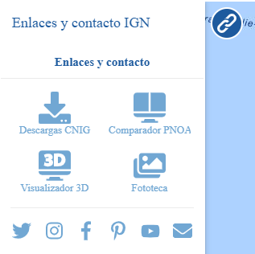

<p align="center">
  
</p>
<h1 align="center"><strong>API IDEE</strong> <small>🔌 IDEE.plugin.ContactLink</small></h1>

# Descripción

Provee de enlaces a sitios, redes sociales y correo institucionales.

|  Herramienta abierta  |Herramienta cerrada
|:----:|:----:|
|||

# Dependencias

Para que el plugin funcione correctamente es necesario importar las siguientes dependencias en el documento html:
Para uso de implementación OpenLayers:
- **contactlink.ol.min.js**
- **contactlink.ol.min.css**

Para uso de implementación Cesium:
- **contactlink.cesium.min.js**
- **contactlink.cesium.min.css**


```html
 <link href="https://componentes.idee.es/api-idee/plugins/contactlink/contactlink.ol.min.css" rel="stylesheet" />
 <script type="text/javascript" src="https://componentes.idee.es/api-idee/plugins/contactlink/contactlink.ol.min.js"></script>
```

# Uso del histórico de versiones

Existe un histórico de versiones de todos los plugins de API-IDEE en [api-idee-legacy](https://github.com/Desarrollos-IDEE/API-IDEE/tree/master/api-idee-legacy/plugins) para hacer uso de versiones anteriores.
Ejemplo:
```html
 <link href="https://componentes.idee.es/api-idee/plugins/contactlink/contactlink-1.0.0.ol.min.css" rel="stylesheet" />
 <script type="text/javascript" src="https://componentes.idee.es/api-idee/plugins/contactlink/contactlink-1.0.0.ol.min.js"></script>
```

# Parámetros

El constructor se inicializa con un JSON con los siguientes atributos:

- **position**: Indica la posición donde se mostrará el plugin.
  - 'left' (LEFT) - A la izquierda.
  - 'right' (RIGHT) - A la derecha.
- **collapsed**: Indica si el plugin viene colapsado de entrada (true/false). Por defecto: true.
- **order**: Determina la prioridad visual dentro del contenedor. Un valor más alto desplaza el botón hacia el final del flujo.
- **tooltip**: Información emergente para mostrar en el tooltip del plugin (se muestra al dejar el ratón encima del plugin como información). Por defecto: "Enlaces y contacto IGN".
- **descargascnig**: Indica la url al centro de descargas CNIG. Por defecto: 'http://centrodedescargas.cnig.es/CentroDescargas/index.jsp'
- **pnoa**: Indica la url al comparador PNOA. Por defecto: 'https://www.ign.es/web/'comparador_pnoa/index.html
- **visualizador3d**: Indica la url al Visualizador3D. Por defecto: 'https://visualizadores.ign.es/estereoscopico/'
- **fototeca**: Indica la url a Fototeca. Por defecto: 'https://fototeca.cnig.es/'
- **twitter**: Indica la url al Twitter del CNIG. Por defecto: 'https://twitter.com/IGNSpain'
- **instagram**: Indica la url al Instagram del CNIG. Por defecto: 'https://www.instagram.com/ignspain/'
- **facebook**: Indica la url al Facebook del CNIG. Por defecto: 'https://www.facebook.com/IGNSpain/'
- **pinterest**: Indica la url al Pinterest del CNIG. Por defecto: 'https://www.pinterest.es/IGNSpain/'
- **youtube**: Indica la url al Youtube del CNIG. Por defecto: 'https://www.youtube.com/user/IGNSpain'
- **mail**: Indica la url para escribir correo al CNIG. Por defecto: 'mailto:consulta@cnig.es'

# API-REST

```javascript
URL_API?contactlink=position*collapsed*order*tooltip*descargascnig*pnoa*visualizador3d*fototeca*twitter*instagram*facebook*pinterest*youtube*mail
```

<table>
  <tr>
    <th>Parámetros</th>
    <th>Opciones/Descripción</th>
    <th>Disponibilidad</th>
  </tr>
  <tr>
    <td>position</td>
    <td>RIGHT/LEFT</td>
    <td>Base64 ✔️ | Separador ✔️</td>
  </tr>
  <tr>
    <td>collapsed</td>
    <td>true/false</td>
    <td>Base64 ✔️ | Separador ✔️</td>
  </tr>
  <tr>
    <td>order</td>
    <td>Número entero positivo</td>
    <td>Base64 ✔️ | Separador ✔️</td>
  </tr>
  <tr>
    <td>tooltip</td>
    <td>Valor a usar para mostrar en el tooltip del plugin</td>
    <td>Base64 ✔️ | Separador ✔️</td>
  </tr>
  <tr>
    <td>descargascnig</td>
    <td>URL del centro de descargas CNIG</td>
    <td>Base64 ✔️ | Separador ✔️</td>
  </tr>
  <tr>
    <td>pnoa</td>
    <td>URL del comparador PNOA</td>
    <td>Base64 ✔️ | Separador ✔️</td>
  </tr>
  <tr>
    <td>visualizador3d</td>
    <td>URL del Visualizador3D</td>
    <td>Base64 ✔️ | Separador ✔️</td>
  </tr>
  <tr>
    <td>fototeca</td>
    <td>URL de Fototeca</td>
    <td>Base64 ✔️ | Separador ✔️</td>
  </tr>
  <tr>
    <td>twitter</td>
    <td>URL del Twitter del CNIG</td>
    <td>Base64 ✔️ | Separador ✔️</td>
  </tr>
  <tr>
    <td>instagram</td>
    <td>URL del Instagram del CNIG</td>
    <td>Base64 ✔️ | Separador ✔️</td>
  </tr>
  <tr>
    <td>facebook</td>
    <td>URL del Facebook del CNIG</td>
    <td>Base64 ✔️ | Separador ✔️</td>
  </tr>
  <tr>
    <td>pinterest</td>
    <td>URL del Pinterest del CNIG</td>
    <td>Base64 ✔️ | Separador ✔️</td>
  </tr>
  <tr>
    <td>youtube</td>
    <td>URL del Youtube del CNIG</td>
    <td>Base64 ✔️ | Separador ✔️</td>
  </tr>
  <tr>
    <td>mail</td>
    <td>URL del correo del CNIG</td>
    <td>Base64 ✔️ | Separador ✔️</td>
  </tr>
</table>


### Ejemplos de uso API-REST

```
https://componentes.idee.es/api-idee/?contactlink=left*true*2*Contacta%20con%20nosotros*http://centrodedescargas.cnig.es/CentroDescargas/index.jsp*https://www.ign.es/web/comparador_pnoa/index.html*https://www.ign.es/3D-Stereo/*https://fototeca.cnig.es/*https://twitter.com/IGNSpain*https://www.instagram.com/ignspain/*https://www.facebook.com/IGNSpain/*https://www.pinterest.es/IGNSpain/*https://www.youtube.com/user/IGNSpain*mailto:consulta@cnig.es
```

```
https://componentes.idee.es/api-idee/?contactlink=right*true*0
```

### Ejemplos de uso API-REST en base64

Ejemplo del constructor:
```javascript
{
  position:"left",
  collapsed:true,
  order:2
  descargascnig:"http://centrodedescargas.cnig.es/CentroDescargas/index.jsp",
  pnoa:"https://www.ign.es/web/comparador_pnoa/index.html",
  visualizador3d:"https://www.ign.es/3D-Stereo/",
  fototeca:"https://fototeca.cnig.es/",
  twitter:"https://twitter.com/IGNSpain",
  instagram:"https://www.instagram.com/ignspain/",
  facebook:"https://www.facebook.com/IGNSpain/",
  pinterest:"https://www.pinterest.es/IGNSpain/",
  youtube:"https://www.youtube.com/user/IGNSpain",
  mail:"mailto:consulta@cnig.es",
  tooltip:"Contacta con nosotros"
}
```
```
https://api-ideedes.grupotecopy.es/api-idee/?contactlink=base64=eyJwb3NpdGlvbiI6ImxlZnQiLCJjb2xsYXBzZWQiOnRydWUsIm9yZGVyIjoyLCJ0b29sdGlwIjoiQ29udGFjdGEgY29uIG5vc290cm9zIiwiZGVzY2FyZ2FzY25pZyI6Imh0dHA6Ly9jZW50cm9kZWRlc2Nhcmdhcy5jbmlnLmVzL0NlbnRyb0Rlc2Nhcmdhcy9pbmRleC5qc3AiLCJwbm9hIjoiaHR0cHM6Ly93d3cuaWduLmVzL3dlYi9jb21wYXJhZG9yX3Bub2EvaW5kZXguaHRtbCIsInZpc3VhbGl6YWRvcjNkIjoiaHR0cHM6Ly93d3cuaWduLmVzLzNELVN0ZXJlby8iLCJmb3RvdGVjYSI6Imh0dHBzOi8vZm90b3RlY2EuY25pZy5lcy8iLCJ0d2l0dGVyIjoiaHR0cHM6Ly90d2l0dGVyLmNvbS9JR05TcGFpbiIsImluc3RhZ3JhbSI6Imh0dHBzOi8vd3d3Lmluc3RhZ3JhbS5jb20vaWduc3BhaW4vIiwiZmFjZWJvb2siOiJodHRwczovL3d3dy5mYWNlYm9vay5jb20vSUdOU3BhaW4vIiwicGludGVyZXN0IjoiaHR0cHM6Ly93d3cucGludGVyZXN0LmVzL0lHTlNwYWluLyIsInlvdXR1YmUiOiJodHRwczovL3d3dy55b3V0dWJlLmNvbS91c2VyL0lHTlNwYWluIiwibWFpbCI6Im1haWx0bzpjb25zdWx0YUBjbmlnLmVzIn0=
```


# Ejemplo de uso

```javascript
const mp = new ContactLink({
  position: 'left',
  collapsed: false,
  order: 2,
  descargascnig: 'http://centrodedescargas.cnig.es/CentroDescargas/index.jsp',
  pnoa: 'https://www.ign.es/web/comparador_pnoa/index.html',
  visualizador3d: 'https://visualizadores.ign.es/estereoscopico/',
  fototeca: 'https://fototeca.cnig.es/',
  twitter: 'https://twitter.com/IGNSpain',
  instagram: 'https://www.instagram.com/ignspain/',
  facebook: 'https://www.facebook.com/IGNSpain/',
  pinterest: 'https://www.pinterest.es/IGNSpain/',
  youtube: 'https://www.youtube.com/user/IGNSpain',
  mail: 'mailto:consulta@cnig.es',
});

map.addPlugin(mp);
```

# 👨‍💻 Desarrollo

Para el stack de desarrollo de este componente se ha utilizado

* NodeJS Version: 14.16
* NPM Version: 6.14.11
* Entorno Windows.

## 📐 Configuración del stack de desarrollo / *Work setup*


### 🐑 Clonar el repositorio / *Cloning repository*

Para descargar el repositorio en otro equipo lo clonamos:

```bash
git clone [URL del repositorio]
```

### 1️⃣ Instalación de dependencias / *Install Dependencies*

```bash
npm i
```

### 2️⃣ Arranque del servidor de desarrollo / *Run Application*

```bash
npm start:ol
npm start:cesium
```

## 📂 Estructura del código / *Code scaffolding*

```any
/
├── src 📦                  # Código fuente
├── task 📁                 # EndPoints
├── test 📁                 # Testing
├── webpack-config 📁       # Webpack configs
└── ...
```
## 📌 Metodologías y pautas de desarrollo / *Methodologies and Guidelines*

Metodologías y herramientas usadas en el proyecto para garantizar el Quality Assurance Code (QAC)

* ESLint
  * [NPM ESLint](https://www.npmjs.com/package/eslint) \
  * [NPM ESLint | Airbnb](https://www.npmjs.com/package/eslint-config-airbnb)

## ⛽️ Revisión e instalación de dependencias / *Review and Update Dependencies*

Para la revisión y actualización de las dependencias de los paquetes npm es necesario instalar de manera global el paquete/ módulo "npm-check-updates".

```bash
# Install and Run
$npm i -g npm-check-updates
$ncu
```

## Tabla de compatibilidad de versiones   
[Consulta el api resourcePlugin](https://componentes.idee.es/api-idee/api/actions/resourcesPlugins?name=contactlink)