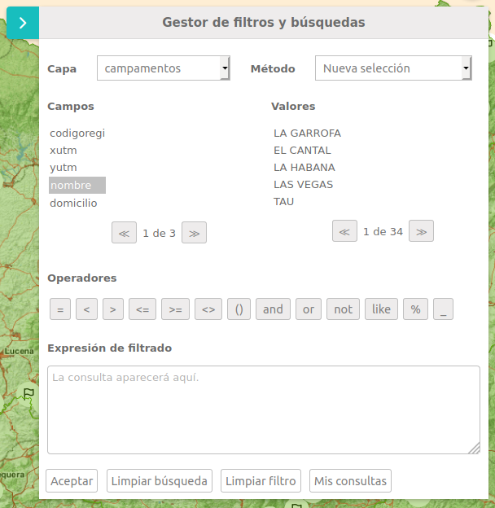

<p align="center">
  
</p>
<h1 align="center"><strong>API IDEE</strong> <small>🔌 IDEE.plugin.FilteredSearch</small></h1>

# Descripción

Plugin que permite aplicar filtros sobre las capas de un mapa y visualizar de forma gráfica las features que cumplen los filtros. Permite guardar consultas, combinarlas y exportar los resultados de estas.



## Dependencias

Para que el plugin funcione correctamente es necesario importar las siguientes dependencias en el documento html:
Para uso de implementación OpenLayers:
- **filteredsearch.ol.min.js**
- **filteredsearch.ol.min.css**

Para uso de implementación Cesium:
- **filteredsearch.cesium.min.js**
- **filteredsearch.cesium.min.css**

```html
 <link href="https://componentes.idee.es/api-idee/plugins/filteredsearch/filteredsearch.ol.min.css" rel="stylesheet" />
 <script type="text/javascript" src="https://componentes.idee.es/api-idee/plugins/filteredsearch/filteredsearch.ol.min.js"></script>
```

# Uso del histórico de versiones

Existe un histórico de versiones de todos los plugins de API-IDEE en [api-idee-legacy](https://github.com/Desarrollos-IDEE/API-IDEE/tree/master/api-idee-legacy/plugins) para hacer uso de versiones anteriores.
Ejemplo:
```html
 <link href="https://componentes.idee.es/api-idee/plugins/filteredsearch/filteredsearch-1.0.0.ol.min.css" rel="stylesheet" />
 <script type="text/javascript" src="https://componentes.idee.es/api-idee/plugins/filteredsearch/filteredsearch-1.0.0.ol.min.js"></script>
```

## Parámetros

El constructor se inicializa con un JSON con los siguientes atributos:

- **position**. Indica la posición donde se mostrará el plugin
    - 'TL':top left
    - 'TR':top right (default)
    - 'BL':bottom left
    - 'BR':bottom right

# API-REST

```javascript
URL_API?filteredsearch=position
```

<table>
    <tr>
        <th>Parámetros</th>
        <th>Opciones/Descripción</th>
        <th>Disponibilidad</th>
    </tr>
    <tr>
        <td>position</td>
        <td>TR/TL/BR/BL</td>
        <td>Base64 ✔️ | Separador ✔️</td>
    </tr>
</table>

### Ejemplos de uso API-REST
```
https://componentes.idee.es/api-idee?filteredsearch=position
```

```
https://componentes.idee.es/api-idee?filteredsearch=BR&layers=OSM,WFS*RED_REGENTE*https://www.ign.es/wfs/redes-geodesicas?*RED_REGENTE*POINT
```

### Ejemplo de uso API-REST en base64

Para la codificación en base64 del objeto con los parámetros del plugin podemos hacer uso de la utilidad IDEE.utils.encodeBase64.
Ejemplo:
```javascript
IDEE.utils.encodeBase64(obj_params);
```

Ejemplo de constructor:
```javascript
{
  position: 'BR',
}
```
```
https://componentes.idee.es/api-idee?filteredsearch=base64=eyJwb3NpdGlvbiI6IkJSIn0=&layers=OSM,WFS*RED_REGENTE*https://www.ign.es/wfs/redes-geodesicas?*RED_REGENTE*POINT
```

    
## Ejemplos de uso

```javascript
   const map = IDEE.map({
     container: 'map'
   });

   const mp = new IDEE.plugin.FilteredSearch({
        position: 'TR',
   });

   map.addPlugin(mp);
```

# 👨‍💻 Desarrollo

Para el stack de desarrollo de este componente se ha utilizado

* NodeJS Versión: 16 o superior
* NPM Versión: 8.19.4 o superior

## 📐 Configuración del stack de desarrollo / *Work setup*


### 🐑 Clonar el repositorio / *Cloning repository*

Para descargar el repositorio en otro equipo lo clonamos:

```bash
git clone [URL del repositorio]
```

### 1️⃣ Instalación de dependencias / *Install Dependencies*

```bash
npm i
```

### 2️⃣ Arranque del servidor de desarrollo / *Run Application*

```bash
npm run start:ol
npm run start:cesium
```

## 📂 Estructura del código / *Code scaffolding*

```any
/
├── src 📦                  # Código fuente
├── legacy 📁               # Histórico de versiones
├── task 📁                 # EndPoints
├── test 📁                 # Testing
├── webpack-config 📁       # Webpack configs
└── ...
```
## 📌 Metodologías y pautas de desarrollo / *Methodologies and Guidelines*

Metodologías y herramientas usadas en el proyecto para garantizar el Quality Assurance Code (QAC)

* ESLint
  * [NPM ESLint](https://www.npmjs.com/package/eslint) \
  * [NPM ESLint | Airbnb](https://www.npmjs.com/package/eslint-config-airbnb)

## ⛽️ Revisión e instalación de dependencias / *Review and Update Dependencies*

Para la revisión y actualización de las dependencias de los paquetes npm es necesario instalar de manera global el paquete/ módulo "npm-check-updates".

```bash
# Install and Run
$npm i -g npm-check-updates
$ncu
```

## Tabla de compatibilidad de versiones   
[Consulta el api resourcePlugin](https://componentes.idee.es/api-idee/api/actions/resourcesPlugins?name=filteredsearch)
