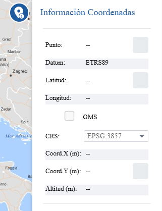
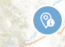

<p align="center">
  
</p>
<h1 align="center"><strong>API IDEE</strong> <small>🔌 IDEE.plugin.Infocoordinates</small></h1>

# Descripción

<p>Plugin que tras hacer click en el mapa, muestra las coordenadas geográficas y proyectadas de ese punto con posibilidad de cambiarlas a ETRS89, WGS84 o REGCAN95 y además cambiar el formato a las geográficas entre decimal y GGMMSS.</p>
<p>Para utilizar un sistema de referencia nuevo, basta con elegir la opción 'Añadir EPSG'. Una vez elegida, el usuario podrá escribir el sistema que desee, siempre y cuando exista.</p>
<p>El sistema de referencia nuevo se registrará a nivel de toda la API, por lo que se podrá utilizar en otras funcionalidades.</p>

|  Herramienta abierta  |Herramienta cerrada
|:----:|:----:|
|||

# Dependencias

Para que el plugin funcione correctamente es necesario importar las siguientes dependencias en el documento html:
Para uso de implementación OpenLayers:
- **infocoordinates.ol.min.js**
- **infocoordinates.ol.min.css**

Para uso de implementación Cesium:
- **infocoordinates.cesium.min.js**
- **infocoordinates.cesium.min.css**

```html
 <link href="https://componentes.idee.es/api-idee/plugins/infocoordinates/infocoordinates.ol.min.css" rel="stylesheet" />
 <script type="text/javascript" src="https://componentes.idee.es/api-idee/plugins/infocoordinates/infocoordinates.ol.min.js"></script>
```

# Uso del histórico de versiones

Existe un histórico de versiones de todos los plugins de API-IDEE en [api-idee-legacy](https://github.com/Desarrollos-IDEE/API-IDEE/tree/master/api-idee-legacy/plugins) para hacer uso de versiones anteriores.
Ejemplo:
```html
 <link href="https://componentes.idee.es/api-idee/plugins/infocoordinates/infocoordinates-1.0.0.ol.min.css" rel="stylesheet" />
 <script type="text/javascript" src="https://componentes.idee.es/api-idee/plugins/infocoordinates/infocoordinates-1.0.0.ol.min.js"></script>
```


# Parámetros

El constructor se inicializa con un JSON con los siguientes atributos:

- **position**:  Indica la posición donde se mostrará el plugin.
  - 'left' (LEFT) - A la izquierda.
  - 'right' (RIGHT) - A la derecha.
- **collapsed**: Indica si el plugin viene colapsado de entrada (true/false). Por defecto: true.
- **collapsible**: Indica si el plugin puede abrirse y cerrarse (true) o si permanece siempre abierto (false). Por defecto: true.
- **order**: Determina la prioridad visual dentro del contenedor. Un valor más alto desplaza el botón hacia el final del flujo.
- **tooltip**: Información emergente para mostrar en el tooltip del plugin (se muestra al dejar el ratón encima del plugin como información). Por defecto: Información Coordenadas.
- **decimalGEOcoord**: Indica el número de decimales de las coordenadas geográficas. Por defecto: 4
- **decimalUTMcoord**: Indica el número de decimales de las coordenadas proyectadas en UTM. Por defecto: 2
- **helpUrl**: URL a la ayuda para el icono. Por defecto: 'https://www.ign.es/'
- **outputDownloadFormat**: Indica el formato de salida del documento que se va a descargar. Se puede elegir entre 'txt' o 'csv'. Por defecto: txt.
- **epsgResults**: Códigos EPSG para mostrar simultáneamente las coordenadas, pero ocultará el selector CRS. Si es nulo se utilizará solamente la proyección usada en el mapa en ese momento y se habilitará el selector CRS.

# API-REST

```javascript
URL_API?infocoordinates=position*collapsed*collapsible*tooltip*decimalGEOcoord*decimalUTMcoord*helpUrl*outputDownloadFormat*epsgResults
```

<table>
  <tr>
    <th>Parámetros</th>
    <th>Opciones/Descripción</th>
    <th>Disponibilidad</th>
  </tr>
  <tr>
    <td>position</td>
    <td>RIGHT/LEFT</td>
    <td>Base64 ✔️ | Separador ✔️</td>
  </tr>
  <tr>
    <td>collapsed</td>
    <td>true/false</td>
    <td>Base64 ✔️  | Separador ✔️ </td>
  </tr>
  <tr>
    <td>collapsible</td>
    <td>true/false</td>
    <td>Base64 ✔️  | Separador ✔️ </td>
  </tr>
  <tr>
    <td>order</td>
    <td>Número entero positivo</td>
    <td>Base64 ✔️  | Separador ✔️ </td>
  </tr>
  <tr>
    <td>tooltip</td>
    <td>Valor a usar para mostrar en el tooltip del plugin</td>
    <td>Base64 ✔️ | Separador ✔️</td>
  </tr>
  <tr>
    <td>decimalGEOcoord</td>
    <td>Número de decimales de las coordenadas geográficas</td>
    <td>Base64 ✔️ | Separador ✔️</td>
  </tr>
  <tr>
    <td>decimalUTMcoord</td>
    <td>Número de decimales de la coordenadas en UTM</td>
    <td>Base64 ✔️ | Separador ✔️</td>
  </tr>
  <tr>
    <td>helpUrl</td>
    <td>URL a la ayuda</td>
    <td>Base64 ✔️ | Separador ✔️</td>
  </tr>
  <tr>
    <td>outputDownloadFormat</td>
    <td>txt/csv</td>
    <td>Base64 ✔️ | Separador ✔️</td>
  </tr>
  <tr>
    <td>outputDownloadFormat</td>
    <td>Array de códigos EPSG</td>
    <td>Base64 ✔️ | Separador ❌</td>
  </tr>
</table>


### Ejemplo de uso API-REST

```
https://componentes.idee.es/api-idee?infocoordinates=TL*true*true*Coordenadas*4*2*https%3A%2F%2Fvisores-cnig-gestion-publico.desarrollo.guadaltel.es%2Fiberpix%2Fhelp%3Fnode%3Dnode107*txt
```

### Ejemplo de uso API-REST en base64

Para la codificación en base64 del objeto con los parámetros del plugin podemos hacer uso de la utilidad IDEE.utils.encodeBase64.
Ejemplo:
```javascript
IDEE.utils.encodeBase64(obj_params);
```

Ejemplo del constructor:
```javascript
{
  position: "right",
  collapsible: true,
  collapsed: true,
  order: 0,
  tooltip: "Información coordenadas",
  outputDownloadFormat: "txt",
  decimalGEOcoord: 4,
  decimalUTMcoord: 4,
  helpUrl: "https://www.ign.es/",
  epsgResults: [25831,4326,4258,3857],
}
```

```
https://componentes.idee.es/api-idee?infocoordinates=base64=eyJwb3NpdGlvbiI6IlRSIiwiY29sbGFwc2libGUiOnRydWUsImNvbGxhcHNlZCI6dHJ1ZSwidG9vbHRpcCI6IkNvb3JkZW5hZGFzIiwib3V0cHV0RG93bmxvYWRGb3JtYXQiOiJ0eHQiLCJkZWNpbWFsR0VPY29vcmQiOjQsImRlY2ltYWxVVE1jb29yZCI6NCwiaGVscFVybCI6Imh0dHBzOi8vd3d3Lmlnbi5lcy8ifQ==
```

# Ejemplo de uso

```javascript
const map = IDEE.map({
  container: 'map'
});

const mp = new IDEE.plugin.Infocoordinates({
  position: 'right',
  collapsed: true,
  collapsible: true,
  order: 0,
  tooltip: 'Información coordenadas',
  decimalGEOcoord: 4,
  decimalUTMcoord: 2,
  epsgResults: [25831,4326,4258,3857],
});

map.addPlugin(mp);
```

# 👨‍💻 Desarrollo

Para el stack de desarrollo de este componente se ha utilizado

* NodeJS Version: 14.16
* NPM Version: 6.14.11
* Entorno Windows.

## 📐 Configuración del stack de desarrollo / *Work setup*


### 🐑 Clonar el repositorio / *Cloning repository*

Para descargar el repositorio en otro equipo lo clonamos:

```bash
git clone [URL del repositorio]
```

### 1️⃣ Instalación de dependencias / *Install Dependencies*

```bash
npm i
```

### 2️⃣ Arranque del servidor de desarrollo / *Run Application*

```bash
npm start:ol
npm start:cesium
```

## 📂 Estructura del código / *Code scaffolding*

```any
/
├── src 📦                  # Código fuente
├── task 📁                 # EndPoints
├── test 📁                 # Testing
├── webpack-config 📁       # Webpack configs
└── ...
```
## 📌 Metodologías y pautas de desarrollo / *Methodologies and Guidelines*

Metodologías y herramientas usadas en el proyecto para garantizar el Quality Assurance Code (QAC)

* ESLint
  * [NPM ESLint](https://www.npmjs.com/package/eslint) \
  * [NPM ESLint | Airbnb](https://www.npmjs.com/package/eslint-config-airbnb)

## ⛽️ Revisión e instalación de dependencias / *Review and Update Dependencies*

Para la revisión y actualización de las dependencias de los paquetes npm es necesario instalar de manera global el paquete/ módulo "npm-check-updates".

```bash
# Install and Run
$npm i -g npm-check-updates
$ncu
```

## Tabla de compatibilidad de versiones   
[Consulta el api resourcePlugin](https://componentes.idee.es/api-idee/api/actions/resourcesPlugins?name=infocoordinates)