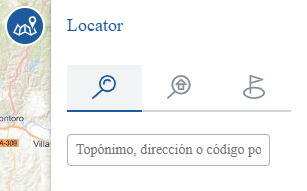

<p align="center">
  
</p>
<h1 align="center"><strong>API IDEE</strong> <small>🔌 IDEE.plugin.Locator</small></h1>

# Descripción

Plugin que permite utilizar diferentes herramientas para la localización:
- Servicio REST geocoder-directo: permite la búsqueda de direcciones postales, topónimos, puntos de interés, entidades de población, unidades administrativas, referencias catastrales (servicio SOAP de la Dirección General de Catastro) y solamente para su visualización los códigos postales.
- Servicio REST geocoder-inverso: Obtener dirección en un punto del mapa.
- Localizar coordenadas en varios SRS.
- Buscar por polígono y parcela.
- Buscar por catastro.
- Consultar referencia catastral.

Esta extensión es una fachada del servicio geocoder. En la siguiente dirección se puede encontrar toda la información sobre el servicio geocoder:
https://www.idee.es/resources/documentos/Cartociudad/CartoCiudad_ServiciosWeb.pdf#page=6&zoom=100,109,585

|  Herramienta abierta  |Herramienta cerrada
|:----:|:----:|
|||

# Dependencias

Para que el plugin funcione correctamente es necesario importar las siguientes dependencias en el documento html:
Para uso de implementación OpenLayers:
- **locator.ol.min.js**
- **locator.ol.min.css**

Para uso de implementación Cesium:
- **locator.cesium.min.js**
- **locator.cesium.min.css**

```html
 <link href="https://componentes.idee.es/api-idee/plugins/locator/locator.ol.min.css" rel="stylesheet" />
 <script type="text/javascript" src="https://componentes.idee.es/api-idee/plugins/locator/locator.ol.min.js"></script>
```

# Uso del histórico de versiones

Existe un histórico de versiones de todos los plugins de API-IDEE en [api-idee-legacy](https://github.com/Desarrollos-IDEE/API-IDEE/tree/master/api-idee-legacy/plugins) para hacer uso de versiones anteriores.
Ejemplo:
```html
 <link href="https://componentes.idee.es/api-idee/plugins/locator/locator-1.0.0.ol.min.css" rel="stylesheet" />
 <script type="text/javascript" src="https://componentes.idee.es/api-idee/plugins/locator/locator-1.0.0.ol.min.js"></script>
```

# Parámetros

El constructor se inicializa con un JSON con los siguientes atributos:

- **position**:  Ubicación del plugin sobre el mapa.
  - 'left' (LEFT) - A la izquierda.
  - 'right' (RIGHT) - A la derecha.
- **collapsed**: Indica si el plugin viene colapsado de entrada (true/false). Por defecto: true.
- **collapsible**: Indica si el plugin puede abrirse y cerrarse (true) o si permanece siempre abierto (false). Por defecto: true.
- **order**: Determina la prioridad visual dentro del contenedor. Un valor más alto desplaza el botón hacia el final del flujo.
- **tooltip**: Texto que se muestra al dejar el ratón encima del plugin. Por defecto: Buscar un lugar.
- **zoom**: Zoom que aplicará al mostrar resultado de tipo puntual. Por defecto: 16.
- **useProxy**: Determina si se desea que las peticiones que se realizan en el control de búsqueda de lugares se realizan con el proxy o no. Por defecto: true.
  - Nota: sólo afecta a las peticiones de búsquedas por lugares. Las peticiones a catastro siempre se realizarán con el proxy.
- **pointStyle**: Tipo de icono a mostrar cuando se encuentra un resultado de tipo puntual.
  - 'pinAzul' (por defecto)
  - 'pinRojo'
  - 'pinMorado'
- **isDraggable**: Permite mover el plugin por el mapa. Por defecto: false.
- **byParcelCadastre**: Indica si el control InfoCatastro se añade al plugin (true/false/Object). Por defecto: true. Para modificar los valores por defecto de este control se seguirá el siguiente formato:
  - **cadastreWMS**: Url del servicio para la consulta por referencia catastral. Por defecto: 'https://ovc.catastro.meh.es/ovcservweb/OVCSWLocalizacionRC/OVCCoordenadas.asmx/Consulta_RCCOOR'.
  - **CMC_url**: Url del servicio para la consulta de municipios de una provincia. Por defecto: 'https://ovc.catastro.meh.es/ovcservweb/OVCSWLocalizacionRC/OVCCallejeroCodigos.asmx/ConsultaMunicipioCodigos'.
  - **DNPPP_url**: Url del servicio para la consulta de datos no protegidos para un inmueble por su polígono parcela. Por defecto: 'https://ovc.catastro.meh.es/ovcservweb/OVCSWLocalizacionRC/OVCCallejeroCodigos.asmx/Consulta_DNPPP_Codigos'.
  - **CPMRC_url**: Url del servicio para consulta de coordenadas por Provincia, Municipio y Referencia Catastral. Por defecto: 'https://ovc.catastro.meh.es/ovcservweb/OVCSWLocalizacionRC/OVCCoordenadas.asmx/Consulta_CPMRC'.

  ```javascript
  byParcelCadastre: {
    cadastreWMS: 'https://ovc.catastro.meh.es/ovcservweb/OVCSWLocalizacionRC/OVCCoordenadas.asmx/Consulta_RCCOOR',
    CMC_url: 'https://ovc.catastro.meh.es/ovcservweb/OVCSWLocalizacionRC/OVCCallejeroCodigos.asmx/ConsultaMunicipioCodigos',
    DNPPP_url: 'https://ovc.catastro.meh.es/ovcservweb/OVCSWLocalizacionRC/OVCCallejeroCodigos.asmx/Consulta_DNPPP_Codigos',
    CPMRC_url: 'https://ovc.catastro.meh.es/ovcservweb/OVCSWLocalizacionRC/OVCCoordenadas.asmx/Consulta_CPMRC'
  }
  ```
  (Válido sólo para la creación del plugin por JS y API-REST en base64).
- **byCoordinates**: Indica si el control XYLocator se añade al plugin (true/false/Object). Por defecto: true. Para modificar los valores por defecto de este control se seguirá el siguiente formato:
  - **projections**: Proyecciones de origen que se mostrarán para seleccionar las coordenadas a localizar. Por defecto los valores posibles son:
  ```javascript
  [
    { title: 'ETRS89 geographic (4258) dd', code: 'EPSG:4258', units: 'd' },
    { title: 'WGS84 geographic (4326) dd', code: 'EPSG:4326', units: 'd' },
    { title: 'ETRS89 geographic (4258) dms', code: 'EPSG:4258', units: 'dms' },
    { title: 'WGS84 geographic (4326) dms', code: 'EPSG:4326', units: 'dms' },
    { title: 'WGS84 Pseudo Mercator (3857)', code: 'EPSG:3857', units: 'm' },
    { title: 'ETRS89 UTM zone 31N (25831)', code: 'EPSG:25831', units: 'm' },
    { title: 'ETRS89 UTM zone 30N (25830)', code: 'EPSG:25830', units: 'm' },
    { title: 'ETRS89 UTM zone 29N (25829)', code: 'EPSG:25829', units: 'm' },
    { title: 'ETRS89 UTM zone 28N (25828)', code: 'EPSG:25828', units: 'm' },
  ]
  ```
  - **help**: URL de ayuda.

  ```javascript
  byCoordinates: {
    projections: [
      { title: 'ETRS89 geographic (4258) dd', code: 'EPSG:4258', units: 'd' },
      { title: 'ETRS89 geographic (4258) dms', code: 'EPSG:4258', units: 'dms' },
      { title: 'ETRS89 UTM zone 31N (25831)', code: 'EPSG:25831', units: 'm' },
    ],
    help: 'https://epsg.io/'
  }
  ```
  (Válido sólo para la creación del plugin por JS y API-REST en base64).
- **byPlaceAddressPostal**: Indica si el control IGNSearchLocator se añade al plugin (true/false/Object). Por defecto: true. Para modificar los valores por defecto de este control se seguirá el siguiente formato:
  - **maxResults**: Número de resultados en la consulta. Por defecto: 99. Para ajustar este valor a las necesidades de cada visualizador, se recomienda revisar la documentación del servicio Geocoder: https://www.idee.es/resources/documentos/Cartociudad/CartoCiudad_ServiciosWeb.pdf#page=6&zoom=100,109,585 
  - **noProcess**: En geocoder, indica las entidades que no se incluirán en los resultados. Admite combinación de 'municipio, poblacion, toponimo, callejero, carretera, portal, provincia, ngbe, expendeduria, comunidad autónoma'. Por defecto: ''.
  - **countryCode**: Código por defecto del país en la petición a geocoder. Por defecto: 'es'.
  - **reverse**: Valor booleano que indica si la funcionalidad obtener dirección en un punto del mapa está activada (true/false). Por defecto: true.
  - **resultVisibility**: Indica si se muestra o no la geometría del elemento localizado (true/false). Por defecto: true.
  - **urlCandidates**: Url del servicio candidates de geocoder. Por defecto: 'https://www.cartociudad.es/geocoder/api/geocoder/candidatesJsonp'.
  - **urlFind**: Url del servicio find de geocoder. Por defecto: 'https://www.cartociudad.es/geocoder/api/geocoder/findJsonp'.
  - **urlReverse**: Url del servicio geocoding inverso. Por defecto: 'https://www.cartociudad.es/geocoder/api/geocoder/reverseGeocode'.
  - **geocoderCoords**: Búsqueda inicial por longitud, latitud, mediante el uso del Servicio REST geocoder-inverso. Se sitúa en la posición indicada al iniciar la extensión. Por defecto: [].
  - **requestStreet**: URL del findJSON de un resultado de búsqueda, para que aparezca cargado al inicio. Por defecto: ''.

  ```javascript
  byPlaceAddressPostal: {
    maxResults: 10,
    noProcess: 'municipio, poblacion',
    countryCode: 'es',
    reverse: true,
    resultVisibility: true,
    urlCandidates: 'http://visores-cnig-gestion-publico.desarrollo.guadaltel.es/geocoder/api/geocoder/candidatesJsonp',
    urlFind: 'http://visores-cnig-gestion-publico.desarrollo.guadaltel.es/geocoder/api/geocoder/findJsonp',
    urlReverse: 'http://visores-cnig-gestion-publico.desarrollo.guadaltel.es/geocoder/api/geocoder/reverseGeocode',
    requestStreet: 'https://www.cartociudad.es/geocoder/api/geocoder/findJsonp?q=Sevilla&type=provincia&tip_via=null&id=41&portal=null&extension=null',
    geocoderCoords: [-5.741757, 41.512058]
  }
  ```
  (Válido sólo para la creación del plugin por JS y API-REST en base64).

# API-REST

```javascript
URL_API?locator=position*collapsed*collapsible*tooltip*zoom*pointStyle*isDraggable*byParcelCadastre*byCoordinates*byPlaceAddressPostal
```

<table>
  <tr>
    <td>Parámetros</td>
    <td>Opciones/Descripción</td>
    <td>Disponibilidad</td>
  </tr>
  <tr>
    <td>position</td>
    <td>RIGHT/LEFT</td>
    <td>Base64 ✔️ | Separador ✔️</td>
  </tr>
  <tr>
    <td>collapsed</td>
    <td>true/false</td>
    <td>Base64 ✔️ | Separador ✔️</td>
  </tr>
  <tr>
    <td>collapsible</td>
    <td>true/false</td>
    <td>Base64 ✔️ | Separador ✔️</td>
  </tr>
  <tr>
    <td>order</td>
    <td>Número entero positivo</td>
    <td>Base64 ✔️  | Separador ✔️ </td>
  </tr>
  <tr>
    <td>tooltip</td>
    <td>tooltip</td>
    <td>Base64 ✔️ | Separador ✔️</td>
  </tr>
  <tr>
    <td>zoom</td>
    <td>zoom</td>
    <td>Base64 ✔️ | Separador ✔️</td>
  </tr>
  <tr>
    <td>useProxy</td>
    <td>useProxy</td>
    <td>Base64 ✔️ | Separador ✔️</td>
  </tr>
  <tr>
    <td>pointStyle</td>
    <td>pinAzul/pinRojo/pinMorado</td>
    <td>Base64 ✔️ | Separador ✔️</td>
  </tr>
  <tr>
    <td>isDraggable</td>
    <td>true/false</td>
    <td>Base64 ✔️ | Separador ✔️</td>
  </tr>
  <tr>
    <td>byParcelCadastre (*)</td>
    <td>true/false</td>
    <td>Base64 ✔️ | Separador ✔️</td>
  </tr>
  <tr>
    <td>byCoordinates (*)</td>
    <td>true/false</td>
    <td>Base64 ✔️ | Separador ✔️</td>
  </tr>
  <tr>
    <td>byPlaceAddressPostal (*)</td>
    <td>true/false</td>
    <td>Base64 ✔️ | Separador ✔️</td>
  </tr>
</table>
(*) Estos parámetros podrán ser enviados por API-REST con los valores true o false. Si es true indicará al plugin que se añada el control con los valores por defecto. Los valores por defecto se modificarán únicamente mediante API-REST en base64.
### Ejemplos de uso API-REST

```
https://componentes.idee.es/api-idee?locator=TL*true*true*tooltip*16
```

```
https://componentes.idee.es/api-idee?locator=TL*true*true*tooltip*16*pinAzul*true*false*true*true
```

### Ejemplo de uso

Para la codificación en base64 del objeto con los parámetros del plugin podemos hacer uso de la utilidad IDEE.utils.encodeBase64.
Ejemplo:
```javascript
IDEE.utils.encodeBase64(obj_params);
```

```
Ejemplo de constructor del plugin: {position:'left', collapsible: true, collapsed: true, tooltip: 'Localización', byParcelCadastre: true, byCoordinates: false, byPlaceAddressPostal: true}

https://componentes.idee.es/api-idee?locator=base64=eyJwb3NpdGlvbiI6IlRMIiwiY29sbGFwc2libGUiOnRydWUsImNvbGxhcHNlZCI6dHJ1ZSwidG9vbHRpcCI6IkxvY2FsaXphY2nDs24iLCJieVBhcmNlbENhZGFzdHJlIjp0cnVlLCJieUNvb3JkaW5hdGVzIjpmYWxzZSwiYnlQbGFjZUFkZHJlc3NQb3N0YWwiOnRydWV9
```

# Eventos

- **infocatastro:locationCentered**
  - Evento que se dispara cuando se ha localizado la búsqueda del plugin sobre el mapa.
  - Expone, como parámetro devuelto, el **punto** actual calculado en la búsqueda.

```javascript
mp.on('infocatastro:locationCentered', (data) => {
   window.alert(`zoom: ${data.zoom}
   center: ${data.center[0].toFixed(2)}, ${data.center[1].toFixed(2)}`);
});
```

- **xylocator:locationCentered**
  - Evento que se dispara cuando se ha localizado la búsqueda del plugin sobre el mapa.
  - Expone, como parámetro devuelto, el **punto** actual calculado en la búsqueda.

```javascript
mp.on('xylocator:locationCentered', (data) => {
   window.alert(`zoom: ${data.zoom}
   center: ${data.center[0].toFixed(2)}, ${data.center[1].toFixed(2)}`);
});
```

- **ignsearchlocator:entityFound**
  - Evento que se dispara cuando se ha localizado la búsqueda del plugin sobre el mapa.
  - Expone, como parámetro devuelto, el **extent** actual calculado en la búsqueda

```javascript
pluginignsearchlocator.on('ignsearchlocator:entityFound', (extent) => {
  // eslint-disable-next-line no-alert
  window.alert('Encontrado');
});
```

# Ejemplo de uso

```javascript
const map = IDEE.map({
  container: 'map'
});

const mp = new IDEE.plugin.Locator({
  position: 'right',
  collapsible: true,
  collapsed: true,
  order: 1,
  zoom: 16,
  pointStyle: 'pinMorado',
  byParcelCadastre: false,
  byCoordinates: true,
  byPlaceAddressPostal: {
    maxResults: 5,
    noProcess: 'municipio, poblacion',
    reverse: false,
    geocoderCoords: [-5.741757, 41.512058],
  },
  isDraggable: false,
});

map.addPlugin(mp);
```


# 👨‍💻 Desarrollo

Para el stack de desarrollo de este componente se ha utilizado

* NodeJS Version: 14.16
* NPM Version: 6.14.11
* Entorno Windows.

## 📐 Configuración del stack de desarrollo / *Work setup*


### 🐑 Clonar el repositorio / *Cloning repository*

Para descargar el repositorio en otro equipo lo clonamos:

```bash
git clone [URL del repositorio]
```

### 1️⃣ Instalación de dependencias / *Install Dependencies*

```bash
npm i
```

### 2️⃣ Arranque del servidor de desarrollo / *Run Application*

```bash
npm start:ol
npm start:cesium
```

## 📂 Estructura del código / *Code scaffolding*

```any
/
├── src 📦                  # Código fuente
├── task 📁                 # EndPoints
├── test 📁                 # Testing
├── webpack-config 📁       # Webpack configs
└── ...
```
## 📌 Metodologías y pautas de desarrollo / *Methodologies and Guidelines*

Metodologías y herramientas usadas en el proyecto para garantizar el Quality Assurance Code (QAC)

* ESLint
  * [NPM ESLint](https://www.npmjs.com/package/eslint) \
  * [NPM ESLint | Airbnb](https://www.npmjs.com/package/eslint-config-airbnb)

## ⛽️ Revisión e instalación de dependencias / *Review and Update Dependencies*

Para la revisión y actualización de las dependencias de los paquetes npm es necesario instalar de manera global el paquete/ módulo "npm-check-updates".

```bash
# Install and Run
$npm i -g npm-check-updates
$ncu
```

## Tabla de compatibilidad de versiones   
[Consulta el api resourcePlugin](https://componentes.idee.es/api-idee/api/actions/resourcesPlugins?name=locator)