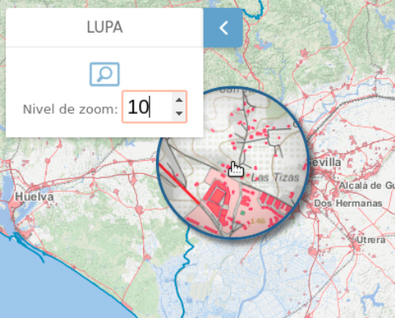

<p align="center">
  
</p>
<h1 align="center"><strong>API IDEE</strong> <small>🔌 IDEE.plugin.Magnify</small></h1>

# Descripción
Plugin que permite realizar un efecto de zoom o de lupa sobre una o varias capas




# Dependencias
Para que el plugin funcione correctamente es necesario importar las siguientes dependencias en el documento html:
Para uso de implementación OpenLayers:
- **magnify.ol.min.js**
- **magnify.ol.min.css**

Para uso de implementación Cesium:
- **magnify.cesium.min.js**
- **magnify.cesium.min.css**

# Uso del histórico de versiones

Existe un histórico de versiones de todos los plugins en el directorio `legacy/` de cada plugin. 
Es recomendable fijar las versiones para evitar errores inesperados.

Ejemplo con el plugin Magnify, implementación OpenLayers y versión 1.0.0:
- **magnify-1.0.0.ol.min.css**
- **magnify-1.0.0.ol.min.js**

## Parámetros

El constructor se inicializa con un JSON con los siguientes atributos:

- **layers**. String que contiene el nombre de las capas que se quieren seleccionar del mapa. A estas capas se les aplicará el filtro de lupa. Si este campo está vacío, el efecto lupa se aplicará a todas las capas.
- **position**. Indica la posición donde se mostrará el plugin.
  - 'TL':top left
  - 'TR':top right (default)
  - 'BL':bottom left
  - 'BR':bottom right
- **zoom**. campo numérico que define el zoom inicial. (Valor por defecto 1)
- **zoomMax**. campo numérico que define el nivel maximo de zoom. (Valor por defecto 10)

# API-REST

```javascript
URL_API?magnify=position*layers*zoomMax*zoom
```

<table>
    <tr>
        <th>Parámetros</th>
        <th>Opciones/Descripción</th>
        <th>Disponibilidad</th>
    </tr>
    <tr>
        <td>position</td>
        <td>TR/TL/BR/BL</td>
        <td>Base64 ✔️ | Separador ✔️</td>
    </tr>
     <tr>
        <td>layers</td>
        <td>Cadena con nombres de URL separados por comas</td>
        <td>Base64 ✔️ | Separador ✔️</td>
    </tr>
    <tr>
        <td>zoomMax</td>
        <td>nivel maximo de zoomt</td>
        <td>Base64 ✔️ | Separador ✔️</td>
    </tr>
         <tr>
        <td>zoom</td>
        <td>zoom inicial</td>
        <td>Base64 ✔️ | Separador ✔️</td>
    </tr>
</table>

### Ejemplos de uso API-REST
```
https://componentes.idee.es/api-idee?magnify=position*layers*zoomMax*zoom
```

```
https://componentes.idee.es/api-idee?layers=OSM,WMTS*https://www.ign.es/wmts/pnoa-ma?*OI.OrthoimageCoverage*EPSG:25830*imagen*true*image/jpeg&projection=EPSG:25830&magnify=TL*OI.OrthoimageCoverage*16*5
```

### Ejemplo de uso API-REST en base64

Para la codificación en base64 del objeto con los parámetros del plugin podemos hacer uso de la utilidad IDEE.utils.encodeBase64.
Ejemplo:
```javascript
IDEE.utils.encodeBase64(obj_params);
```

Ejemplo de constructor:
```javascript
{
  position: 'TL',
  zoomMax: 19,
  zoom: 5,
  layers: 'OI.OrthoimageCoverage'
}
```

```
https://componentes.idee.es/api-idee?layers=OSM,WMTS*https://www.ign.es/wmts/pnoa-ma?*OI.OrthoimageCoverage*EPSG:25830*imagen*true*image/jpeg&projection=EPSG:25830&magnify=base64=eyJwb3NpdGlvbiI6IlRMIiwiem9vbU1heCI6MTksInpvb20iOjUsImxheWVycyI6Ik9JLk9ydGhvaW1hZ2VDb3ZlcmFnZSJ9
```


# Ejemplos de uso

## Ejemplo 1
```javascript
const mp = new IDEE.plugin.Magnify({
  position: 'TL',
  zoomMax: 19,
  zoom: 5,
});

map.addPlugin(mp);
```

## Ejemplo 2
```javascript
const mp = new IDEE.plugin.Magnify({
  position: 'TL',
  zoomMax: 19,
  zoom: 5,
  layers: 'provincias,fondo
});

map.addPlugin(mp);
```

## Ejemplo 3
```javascript
const map = M.map({
  container: 'map'
});

const mp = new M.plugin.Magnify({});

map.addPlugin(mp);
```


# 👨‍💻 Desarrollo

Para el stack de desarrollo de este componente se ha utilizado

* NodeJS Versión: 16 o superior
* NPM Versión: 8.19.4 o superior

## 📐 Configuración del stack de desarrollo / *Work setup*


### 🐑 Clonar el repositorio / *Cloning repository*

Para descargar el repositorio en otro equipo lo clonamos:

```bash
git clone [URL del repositorio]
```

### 1️⃣ Instalación de dependencias / *Install Dependencies*

```bash
npm i
```

### 2️⃣ Arranque del servidor de desarrollo / *Run Application*

```bash
npm run start:ol
npm run start:cesium
```

## 📂 Estructura del código / *Code scaffolding*

```any
/
├── src 📦                  # Código fuente
├── legacy 📁               # Histórico de versiones
├── task 📁                 # EndPoints
├── test 📁                 # Testing
├── webpack-config 📁       # Webpack configs
└── ...
```
## 📌 Metodologías y pautas de desarrollo / *Methodologies and Guidelines*

Metodologías y herramientas usadas en el proyecto para garantizar el Quality Assurance Code (QAC)

* ESLint
  * [NPM ESLint](https://www.npmjs.com/package/eslint) \
  * [NPM ESLint | Airbnb](https://www.npmjs.com/package/eslint-config-airbnb)

## ⛽️ Revisión e instalación de dependencias / *Review and Update Dependencies*

Para la revisión y actualización de las dependencias de los paquetes npm es necesario instalar de manera global el paquete/ módulo "npm-check-updates".

```bash
# Install and Run
$npm i -g npm-check-updates
$ncu
```

## Tabla de compatibilidad de versiones   
[Consulta el api resourcePlugin](https://componentes.idee.es/api-idee/api/actions/resourcesPlugins?name=magnify)
