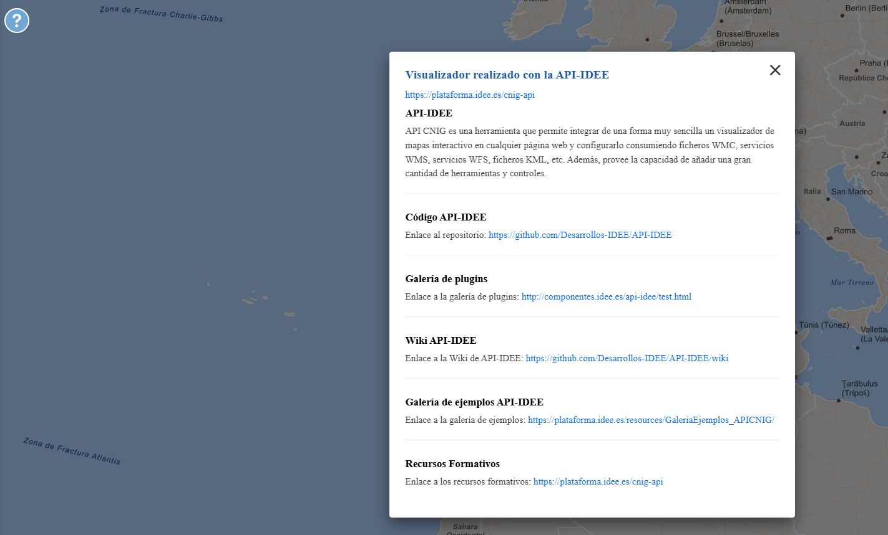

<p align="center">
  
</p>
<h1 align="center"><strong>API IDEE</strong> <small>🔌 IDEE.plugin.Modal</small></h1>

# Descripción

Plugin que muestra información sobre la página y manual de uso.

|  Herramienta abierta  |Herramienta cerrada
|:----:|:----:|
|||

# Dependencias

Para que el plugin funcione correctamente es necesario importar las siguientes dependencias en el documento html:

Para uso de implementación OpenLayers:
- **modal.ol.min.js**
- **modal.ol.min.css**

Para uso de implementación Cesium:
- **modal.cesium.min.js**
- **modal.cesium.min.css**


```html
 <link href="https://componentes.idee.es/api-idee/plugins/modal/modal.ol.min.css" rel="stylesheet" />
 <script type="text/javascript" src="https://componentes.idee.es/api-idee/plugins/modal/modal.ol.min.js"></script>
```

# Uso del histórico de versiones

Existe un histórico de versiones de todos los plugins de API-IDEE en [api-idee-legacy](https://github.com/Desarrollos-IDEE/API-IDEE/tree/master/api-idee-legacy/plugins) para hacer uso de versiones anteriores.
Ejemplo:
```html
 <link href="https://componentes.idee.es/api-idee/plugins/modal/modal-1.0.0.ol.min.css" rel="stylesheet" />
 <script type="text/javascript" src="https://componentes.idee.es/api-idee/plugins/modal/modal-1.0.0.ol.min.js"></script>
```

# Parámetros

El constructor se inicializa con un JSON con los siguientes atributos:

- **position**:  Ubicación del plugin sobre el mapa.
  - 'left' (LEFT) - A la izquierda.
  - 'right' (RIGHT) - A la derecha.
- **helpLink**: Enlace al manual de uso. Objeto formado por los atributos en y es. Por defecto: template_en, template_es o template_ca.
  - Este parámetro se puede definir también con url_en y url_es directamente. Por defecto: template_en, template_es o template_ca.
- **collapsed**: Indica si el plugin viene colapsado de entrada (true/false). Por defecto: true.
- **collapsible**: Indica si el plugin puede abrirse y cerrarse (true) o si permanece siempre abierto (false). Por defecto: true.
- **order**: Determina la prioridad visual dentro del contenedor. Un valor más alto desplaza el botón hacia el final del flujo.
- **tooltip**. Tooltip que se muestra sobre el plugin. Por defecto: Más información.

# Plantilla HMTL a mostrar en la ventana modal
En los parámetros  **url_en** y **url_es**  se añade la URL de un HTML que se abrirá cuando se haga click sobre el botón de la extensión. Este HTML necesita de unos comentarios de código (<!-- Start Popup Content --> y <!-- End Popup Content -->), desde los cuales se obtendrá la información a mostrar.

Un ejemplo de la plantilla sería el siguiente:

```HTML

<!-- Start Popup Content -->
<div id="popup-box">
    <div class="popup-section">
        <h3>Visualizador realizado con la API-IDEE</h3>
        <p><a href="https://plataforma.idee.es/cnig-api">https://plataforma.idee.es/cnig-api</a></p>
        <p class="popup-title">api-idee</p>
        <p>API CNIG es una herramienta que permite integrar de una forma muy sencilla un visualizador de mapas
            interactivo en cualquier página web y configurarlo consumiendo ficheros WMC, servicios WMS, servicios WFS,
            ficheros KML, etc. Además, provee la capacidad de añadir una gran cantidad de herramientas y controles.</p>
    </div>
    <div class="popup-section">
        <p class="popup-title">Código API-IDEE</p>
        <p>Enlace al repositorio: <a href="https://github.com/Desarrollos-IDEE/API-IDEE">https://github.com/Desarrollos-IDEE/API-IDEE</a></p>
    </div>
    <div class="popup-section">
        <p class="popup-title">Galería de plugins</p>
        <p>Enlace a la galería de plugins: <a href="http://componentes.idee.es/api-idee/test.html">http://componentes.idee.es/api-idee/test.html</a></p>
    </div>
    <div class="popup-section">
        <p class="popup-title">Wiki API-IDEE</p>
        <p>Enlace a la Wiki de API-IDEE: <a href="https://github.com/Desarrollos-IDEE/API-IDEE/wiki">https://github.com/Desarrollos-IDEE/API-IDEE/wiki</a></p>
    </div>
    <div class="popup-section">
        <p class="popup-title">Galería de ejemplos API-IDEE</p>
        <p>Enlace a la galería de ejemplos: <a href="https://plataforma.idee.es/resources/GaleriaEjemplos_APICNIG/">https://plataforma.idee.es/resources/GaleriaEjemplos_APICNIG/</a></p>
    </div>
    <div class="popup-section">
        <p class="popup-title">Recursos Formativos</p>
        <p>Enlace a los recursos formativos: <a href="https://plataforma.idee.es/cnig-api">https://plataforma.idee.es/cnig-api</a></p>
    </div>
</div>
<!-- End Popup Content -->
```


# API-REST

```javascript
URL_API?modal=position*collapse*collapsible*tooltip*url_es*url_en
```

<table>
  <tr>
    <th>Parámetros</th>
    <th>Opciones/Descripción</th>
    <th>Disponibilidad</th>
  </tr>
  <tr>
    <td>position</td>
    <td>RIGHT/LEFT</td>
    <td>Base64 ✔️  | Separador ✔️ </td>
  </tr>
  <tr>
    <td>collapse</td>
    <td>true/false</td>
    <td>Base64 ✔️  | Separador ✔️ </td>
  </tr>
  <tr>
    <td>collapsible</td>
    <td>true/false</td>
    <td>Base64 ✔️  | Separador ✔️ </td>
  </tr>
  <tr>
    <td>order</td>
    <td>Número entero positivo</td>
    <td>Base64 ✔️  | Separador ✔️ </td>
  </tr>
  <tr>
    <td>tooltip</td>
    <td>Valor que se muestra sobre el plugin</td>
    <td>Base64 ✔️  | Separador ✔️ </td>
  </tr>
  <tr>
    <td>url_es</td>
    <td>URL del manual de uso en español</td>
    <td>Base64 ✔️  | Separador ✔️ </td>
  </tr>
  <tr>
    <td>url_en</td>
    <td>URL del manual de uso en inglés</td>
    <td>Base64 ✔️  | Separador ✔️ </td>
  </tr>
</table>


### Ejemplo de uso API-REST

```
https://componentes.idee.es/api-idee?modal=TR*true*true*Ayuda*https://www.ign.es/iberpix/ayuda/es.html*https://www.ign.es/iberpix/ayuda/en.html
```

### Ejemplo de uso API-REST en base64

Para la codificación en base64 del objeto con los parámetros del plugin podemos hacer uso de la utilidad IDEE.utils.encodeBase64.
Ejemplo:
```javascript
IDEE.utils.encodeBase64(obj_params);
```

Ejemplo de constructor:
```javascript
{
  position:'left',
  collapsed: true,
  collapsible: true,
  order: 1,
  url_es: 'https://componentes.cnig.es/ayudaIberpix/es.html',
  url_en: 'https://componentes.cnig.es/ayudaIberpix/en.html',
  url_ca: 'https://componentes.cnig.es/ayudaIberpix/ca.html',
  tooltip: 'Ayuda',
}
```

```
https://componentes.idee.es/api-idee?modal=base64=eyJwb3NpdGlvbiI6IlRSIiwiY29sbGFwc2VkIjp0cnVlLCJjb2xsYXBzaWJsZSI6dHJ1ZSwidXJsX2VzIjoiaHR0cHM6Ly9jb21wb25lbnRlcy5jbmlnLmVzL2F5dWRhSWJlcnBpeC9lcy5odG1sIiwidXJsX2VuIjoiaHR0cHM6Ly9jb21wb25lbnRlcy5jbmlnLmVzL2F5dWRhSWJlcnBpeC9lbi5odG1sIiwidG9vbHRpcCI6IkF5dWRhIn0=

```

# Ejemplo de uso

```javascript
const map = IDEE.map({
  container: 'map'
});


const mp = new IDEE.plugin.Modal({
  position: 'right',
  collapsed: true,
  collapsible: true,
  order: 1,
  tooltip: 'Ayuda',
  url_es: 'https://componentes.cnig.es/ayudaIberpix/es.html',
  url_en: 'https://componentes.cnig.es/ayudaIberpix/en.html',
});

map.addPlugin(mp);
```

# 👨‍💻 Desarrollo

Para el stack de desarrollo de este componente se ha utilizado

* NodeJS Version: 14.16
* NPM Version: 6.14.11
* Entorno Windows.

## 📐 Configuración del stack de desarrollo / *Work setup*


### 🐑 Clonar el repositorio / *Cloning repository*

Para descargar el repositorio en otro equipo lo clonamos:

```bash
git clone [URL del repositorio]
```

### 1️⃣ Instalación de dependencias / *Install Dependencies*

```bash
npm i
```

### 2️⃣ Arranque del servidor de desarrollo / *Run Application*

```bash
npm start:ol
npm start:cesium
```

## 📂 Estructura del código / *Code scaffolding*

```any
/
├── src 📦                  # Código fuente
├── task 📁                 # EndPoints
├── test 📁                 # Testing
├── webpack-config 📁       # Webpack configs
└── ...
```
## 📌 Metodologías y pautas de desarrollo / *Methodologies and Guidelines*

Metodologías y herramientas usadas en el proyecto para garantizar el Quality Assurance Code (QAC)

* ESLint
  * [NPM ESLint](https://www.npmjs.com/package/eslint) \
  * [NPM ESLint | Airbnb](https://www.npmjs.com/package/eslint-config-airbnb)

## ⛽️ Revisión e instalación de dependencias / *Review and Update Dependencies*

Para la revisión y actualización de las dependencias de los paquetes npm es necesario instalar de manera global el paquete/ módulo "npm-check-updates".

```bash
# Install and Run
$npm i -g npm-check-updates
$ncu
```

## Tabla de compatibilidad de versiones   
[Consulta el api resourcePlugin](https://componentes.idee.es/api-idee/api/actions/resourcesPlugins?name=modal)