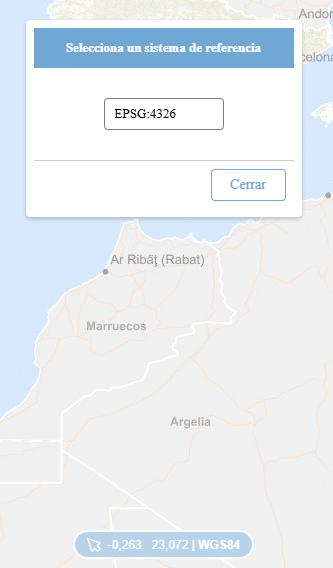
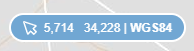

<p align="center">
  
</p>
<h1 align="center"><strong>API IDEE</strong> <small>🔌 IDEE.plugin.MouseSRS</small></h1>

# Descripción

<p>Muestra las coordenas en el sistema de referencia elegido del puntero del ratón. Se puede elegir tanto un sistema de referencia previamente registrado o uno nuevo.</p>
<p>Para utilizar un sistema de referencia nuevo, basta con elegir la opción 'Añadir EPSG'. Una vez elegida, el usuario podrá escribir el sistema que desee, siempre y cuando exista.</p>
<p>El sistema de referencia nuevo se registrará a nivel de toda la API, por lo que se podrá utilizar en otras funcionalidades.</p>

|  Herramienta abierta  |Herramienta cerrada
|:----:|:----:|
|||

# Dependencias

Para que el plugin funcione correctamente es necesario importar las siguientes dependencias en el documento html:
Para uso de implementación OpenLayers:
- **mousesrs.ol.min.js**
- **mousesrs.ol.min.css**

Para uso de implementación Cesium:
- **mousesrs.cesium.min.js**
- **mousesrs.cesium.min.css**


```html
 <link href="https://componentes.idee.es/api-idee/plugins/mousesrs/mousesrs.ol.min.css" rel="stylesheet" />
 <script type="text/javascript" src="https://componentes.idee.es/api-idee/plugins/mousesrs/mousesrs.ol.min.js"></script>
```

# Uso del histórico de versiones

Existe un histórico de versiones de todos los plugins de API-IDEE en [api-idee-legacy](https://github.com/Desarrollos-IDEE/API-IDEE/tree/master/api-idee-legacy/plugins) para hacer uso de versiones anteriores.
Ejemplo:
```html
 <link href="https://componentes.idee.es/api-idee/plugins/mousesrs/mousesrs-1.0.0.ol.min.css" rel="stylesheet" />
 <script type="text/javascript" src="https://componentes.idee.es/api-idee/plugins/mousesrs/mousesrs-1.0.0.ol.min.js"></script>
```


# Parámetros

El constructor se inicializa con un JSON con los siguientes atributos:

- **position**:  Ubicación del plugin sobre el mapa.
  - 'down': Abajo.
- **order**: Determina la prioridad visual dentro del contenedor. Un valor más alto desplaza el botón hacia el final del flujo.
- **tooltip**. Tooltip que se muestra sobre el plugin (Se muestra al dejar el ratón encima del plugin como información). Por defecto: Coordenadas.
- **srs**. Código EPSG del SRS sobre el que se mostrarán las coordenadas del ratón. Por defecto: EPSG:4326
- **label**. Nombre del SRS sobre el que se mostrarán las coordenadas del ratón. Por defecto: WGS84
- **precision**. Precisión de las coordenadas. Por defecto: 4
- **geoDecimalDigits**. Cifras decimales para proyecciones geográficas.
- **utmDecimalDigits**. Cifras decimales para proyecciones UTM.
- **activeZ**. Activar visualización valor z. Por defecto: false
- **helpUrl**. URL a la ayuda para el icono.
- **draggableDialog**. Permite mover el dialog por la pantalla. Por defecto: true.
- **mode**. Tipo de servicio para la obtención de valor z. Posibles valores: wcs, ogcapicoverage. Por defecto: wcs
- **coveragePrecissions**. Lista de JSON con las urls de los coverage junto con los niveles de zoom en los que se utilizan (sólo válido con mode ogcapicoverage).
  - **url**. Url blob del coverage.
  - **minzoom**. Zoom mínimo al que se va a utilizar el coverage (Inclusive).
  - **maxzoom**. Zoom máximo al que se va a utilizar el coverage (Inclusive).

  Por defecto:
```javascript
[
  {
    url: 'https://api-coverages.idee.es/collections/EL.ElevationGridCoverage_4326_1000/coverage',
    minzoom: 0,
    maxzoom: 11,
  },
  {
    url: 'https://api-coverages.idee.es/collections/EL.ElevationGridCoverage_4326_500/coverage',
    minzoom: 12,
    maxzoom: 28,
  },
]
```
# API-REST

```javascript
URL_API?mousesrs=tooltip*srs*label*precision*geoDecimalDigits*utmDecimalDigits*activeZ*helpUrl*draggableDialog*epsgFormat
```

<table>
  <tr>
    <th>Parámetros</th>
    <th>Opciones/Descripción</th>
    <th>Disponibilidad</th>
  <tr>
  <tr>
    <td>position</td>
    <td>DOWN</td>
    <td>Base64 ✔️  | Separador ✔️ </td>
  </tr>
  <tr>
    <td>order</td>
    <td>Número entero positivo</td>
    <td>Base64 ✔️  | Separador ✔️ </td>
  </tr>
  <tr>
    <td>tooltip</td>
    <td>Texto informativo</td>
    <td>Base64 ✔️  | Separador ✔️ </td>
  </tr>
  <tr>
    <td>srs</td>
    <td>Código EPSG del SRS</td>
    <td>Base64 ✔️  | Separador ✔️ </td>
  </tr>
  <tr>
    <td>label</td>
    <td>Nombre del SRS</td>
    <td>Base64 ✔️  | Separador ✔️ </td>
  </tr>
  <tr>
    <td>precision</td>
    <td>Precisión de las coordenadas</td>
    <td>Base64 ✔️  | Separador ✔️ </td>
  </tr>
  <tr>
    <td>geoDecimalDigits</td>
    <td>Cifras decimales para proyecciones geográficas</td>
    <td>Base64 ✔️  | Separador ✔️ </td>
  </tr>
  <tr>
    <td>utmDecimalDigits</td>
    <td>Cifras decimales para proyecciones UTM</td>
    <td>Base64 ✔️  | Separador ✔️ </td>
  </tr>
  <tr>
    <td>activeZ</td>
    <td>true/false</td>
    <td>Base64 ✔️  | Separador ✔️ </td>
  </tr>
  <tr>
    <td>helpUrl</td>
    <td>URL del icono para la ayuda</td>
    <td>Base64 ✔️  | Separador ✔️ </td>
  </tr>
  <tr>
    <td>epsgFormat</td>
    <td>Formatear EPSG</td>
    <td>Base64 ✔️  | Separador ✔️ </td>
  </tr>
</table>


### Ejemplo de uso API-REST

```
https://componentes.idee.es/api-idee?mousesrs=Muestra%20coordenadas*EPSG:4326*WGS84*4
```

### Ejemplo de uso API-REST en base64

Para la codificación en base64 del objeto con los parámetros del plugin podemos hacer uso de la utilidad IDEE.utils.encodeBase64.
Ejemplo:
```javascript
IDEE.utils.encodeBase64(obj_params);
```

Ejemplo del constructor:

```javascript
{
  label: "EPSG:4326",
  helpUrl: "https://www.ign.es/",
  tooltip: "Coordenadas",
}
```

```
https://componentes.idee.es/api-idee?mousesrs=base64=eyJsYWJlbCI6IkVQU0c6NDMyNiIsImhlbHBVcmwiOiJodHRwczovL3d3dy5pZ24uZXMvIiwidG9vbHRpcCI6IkNvb3JkZW5hZGFzIn0=
```

# Ejemplo de uso

```javascript
const mp = new IDEE.plugin.MouseSRS({
  position: 'down',
  tooltip: 'Muestra coordenadas',
  srs: 'EPSG:4326',
  label: 'WGS84',
  precision: 4,
});
```

# 👨‍💻 Desarrollo

Para el stack de desarrollo de este componente se ha utilizado

* NodeJS Version: 14.16
* NPM Version: 6.14.11
* Entorno Windows.

## 📐 Configuración del stack de desarrollo / *Work setup*


### 🐑 Clonar el repositorio / *Cloning repository*

Para descargar el repositorio en otro equipo lo clonamos:

```bash
git clone [URL del repositorio]
```

### 1️⃣ Instalación de dependencias / *Install Dependencies*

```bash
npm i
```

### 2️⃣ Arranque del servidor de desarrollo / *Run Application*

```bash
npm start:ol
npm start:cesium
```

## 📂 Estructura del código / *Code scaffolding*

```any
/
├── src 📦                  # Código fuente
├── task 📁                 # EndPoints
├── test 📁                 # Testing
├── webpack-config 📁       # Webpack configs
└── ...
```
## 📌 Metodologías y pautas de desarrollo / *Methodologies and Guidelines*

Metodologías y herramientas usadas en el proyecto para garantizar el Quality Assurance Code (QAC)

* ESLint
  * [NPM ESLint](https://www.npmjs.com/package/eslint) \
  * [NPM ESLint | Airbnb](https://www.npmjs.com/package/eslint-config-airbnb)

## ⛽️ Revisión e instalación de dependencias / *Review and Update Dependencies*

Para la revisión y actualización de las dependencias de los paquetes npm es necesario instalar de manera global el paquete/ módulo "npm-check-updates".

```bash
# Install and Run
$npm i -g npm-check-updates
$ncu
```

## Tabla de compatibilidad de versiones   
[Consulta el api resourcePlugin](https://componentes.idee.es/api-idee/api/actions/resourcesPlugins?name=mousesrs)