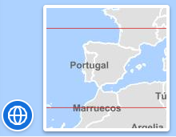

<p align="center">
  
</p>
<h1 align="center"><strong>API IDEE</strong> <small>🔌 IDEE.plugin.OverviewMap</small></h1>

# Descripción

Plugin que muestra una previsualización de la zona donde está centrado el mapa.
⚠️ Si la anchura de pantalla es 768 pixeles o menor, el botón y panel del plugin estarán ocultos.

|  Herramienta abierta  |Herramienta cerrada
|:----:|:----:|
|||

# Dependencias

Para que el plugin funcione correctamente es necesario importar las siguientes dependencias en el documento html:
Para uso de implementación OpenLayers:
- **overviewmap.ol.min.js**
- **overviewmap.ol.min.css**

Para uso de implementación Cesium:
- **overviewmap.cesium.min.js**
- **overviewmap.cesium.min.css**


```html
 <link href="https://componentes.idee.es/api-idee/plugins/overviewmap/overviewmap.ol.min.css" rel="stylesheet" />
 <script type="text/javascript" src="https://componentes.idee.es/api-idee/plugins/overviewmap/overviewmap.ol.min.js"></script>
```

# Uso del histórico de versiones

Existe un histórico de versiones de todos los plugins de API-IDEE en [api-idee-legacy](https://github.com/Desarrollos-IDEE/API-IDEE/tree/master/api-idee-legacy/plugins) para hacer uso de versiones anteriores.
Ejemplo:
```html
 <link href="https://componentes.idee.es/api-idee/plugins/overviewmap/overviewmap-1.0.0.ol.min.css" rel="stylesheet" />
 <script type="text/javascript" src="https://componentes.idee.es/api-idee/plugins/overviewmap/overviewmap-1.0.0.ol.min.js"></script>
```

# Parámetros

El constructor se inicializa con dos objetos JSON. El primero contiene el atributo 'position' y el segundo los atributos 'collapsed' y 'collapsible', descritos a continuación:

- **position**: Indica la posición donde se mostrará el plugin.
  - 'left' (LEFT) - Arriba a la izquierda.
  - 'right' (RIGHT) - Arriba a la derecha (por defecto).
  - 'down' (DOWN) - Abajo.
  - 'center-bottom-right' (CBR) - Zona central, abajo a la derecha.
  - 'center-bottom-left' (CBL) - Zona central, abajo a la izquierda.
  - 'center-top-right' (CTR) - Zona central, arriba a la derecha.
  - 'center-top-left' (CTL) - Zona central, arriba a la izquierda.
- **collapsed**: Indica si el plugin viene colapsado de entrada (true/false). Por defecto: true.
- **collapsible**: Indica si el plugin puede abrirse y cerrarse (true) o si permanece siempre abierto (false). Por defecto: true.
- **order**: Determina la prioridad visual dentro del contenedor. Un valor más alto desplaza el botón hacia el final del flujo.
- **tooltip**. Tooltip que se muestra sobre el plugin (Se muestra al dejar el ratón encima del plugin como información). Por defecto: Mapa de situación.
- **fixed**: Indica si el mapa del plugin permanece a un zoom fijo (true/false). Por defecto: false.
- **zoom**: Indica el nivel del zoom al que permanecerá fijo el mapa del plugin. Por defecto: '' (cadena vacía).
- **baseLayer**: URL de la capa base si se quiere prefijar una en el plugin overviewmap. Por defecto: ```WMTS*http://www.ign.es/wmts/ign-base?*IGNBaseTodo*GoogleMapsCompatible*Mapa IGN*false*image/jpeg*false*false*true```

# API-REST

```javascript
URL_API?overviewmap=position*!collapsed*!collapsible*!tooltip*!fixed*!zoom*!baseLayer
```

<table>
  <tr>
    <th>Parámetros</th>
    <th>Opciones/Descripción</th>
    <th>Disponibilidad</th>
  </tr>
  <tr>
    <td>position</td>
    <td>CTL/CTR/CBL/CBR/LEFT/RIGHT/DOWN</td>
    <td>Base64 ✔️  | Separador ✔️ </td>
  </tr>
  <tr>
    <td>collapsed</td>
    <td>true/false</td>
    <td>Base64 ✔️  | Separador ✔️ </td>
  </tr>
   <tr>
    <td>collapsible</td>
    <td>true/false</td>
    <td>Base64 ✔️  | Separador ✔️ </td>
  </tr>
  <tr>
    <td>order</td>
    <td>Número entero positivo</td>
    <td>Base64 ✔️  | Separador ✔️ </td>
  </tr>
  <tr>
    <td>tooltip</td>
    <td>Texto informativo</td>
    <td>Base64 ✔️  | Separador ✔️ </td>
  </tr>
  <tr>
    <td>fixed</td>
    <td>true/false</td>
    <td>Base64 ✔️  | Separador ✔️ </td>
  </tr>
  <tr>
    <td>zoom</td>
    <td>Nivel de zoom del mapa</td>
    <td>Base64 ✔️  | Separador ✔️ </td>
  </tr>
  <tr>
    <td>baseLayer</td>
    <td>URL de la capa base</td>
    <td>Base64 ✔️  | Separador ✔️ </td>
  </tr>
</table>


### Ejemplos de uso API-REST

```
https://componentes.idee.es/api-idee?overviewmap=LEFT*!true*!true*!Mapa*!true*!5*!WMS*PNOA%202017*https://www.ign.es/wms/pnoa-historico?*PNOA2017*true*true
```

```
https://componentes.idee.es/api-idee?overviewmap=TR*!true*!true*!Mapa
```

### Ejemplo de uso API-REST en base64

Para la codificación en base64 del objeto con los parámetros del plugin podemos hacer uso de la utilidad IDEE.utils.encodeBase64.
Ejemplo:
```javascript
IDEE.utils.encodeBase64(obj_params);
```

Ejemplo de constructor:
```javascript
{
  position: "left",
  fixed: true,
  zoom: 4,
  baseLayer: "WMTS*http://www.ign.es/wmts/ign-base?*IGNBaseTodo*GoogleMapsCompatible*Mapa IGN*false*image/jpeg*false*false*true",
  collapsed: false,
  collapsible: false,
  tooltip: "Mapa",
  order: 1,
}
```
```
https://componentes.idee.es/api-idee?overviewmap=base64=eyJwb3NpdGlvbiI6IkJSIiwiZml4ZWQiOnRydWUsInpvb20iOjQsImJhc2VMYXllciI6IldNVFMqaHR0cDovL3d3dy5pZ24uZXMvd210cy9pZ24tYmFzZT8qSUdOQmFzZVRvZG8qR29vZ2xlTWFwc0NvbXBhdGlibGUqTWFwYSBJR04qZmFsc2UqaW1hZ2UvanBlZypmYWxzZSpmYWxzZSp0cnVlIiwiY29sbGFwc2VkIjpmYWxzZSwiY29sbGFwc2libGUiOmZhbHNlLCJ0b29sdGlwIjoiTWFwYSJ9

```

# Ejemplo de uso

```javascript
  const map = IDEE.map({
    container: 'map'
  });

  const mp = new IDEE.plugin.OverviewMap({
    position: 'left',
    order: 1,
    tooltip: 'Mapa',
    fixed: true,
    zoom: 4,
    //baseLayer: 'WMS*PNOA 2017*https://www.ign.es/wms/pnoa-historico?*PNOA2017*true*true', Ejemplo WMS
    baseLayer: 'WMTS*http://www.ign.es/wmts/ign-base?*IGNBaseTodo*GoogleMapsCompatible*Mapa IGN*false*image/jpeg*false*false*true', //Ejemplo WMTS
  }, {
    collapsed: false,
    collapsible: true,
  });

  map.addPlugin(mp);
```

# 👨‍💻 Desarrollo

Para el stack de desarrollo de este componente se ha utilizado

* NodeJS Version: 14.16
* NPM Version: 6.14.11
* Entorno Windows.

## 📐 Configuración del stack de desarrollo / *Work setup*


### 🐑 Clonar el repositorio / *Cloning repository*

Para descargar el repositorio en otro equipo lo clonamos:

```bash
git clone [URL del repositorio]
```

### 1️⃣ Instalación de dependencias / *Install Dependencies*

```bash
npm i
```

### 2️⃣ Arranque del servidor de desarrollo / *Run Application*

```bash
npm start:ol
npm start:cesium
```

## 📂 Estructura del código / *Code scaffolding*

```any
/
├── src 📦                  # Código fuente
├── task 📁                 # EndPoints
├── test 📁                 # Testing
├── webpack-config 📁       # Webpack configs
└── ...
```
## 📌 Metodologías y pautas de desarrollo / *Methodologies and Guidelines*

Metodologías y herramientas usadas en el proyecto para garantizar el Quality Assurance Code (QAC)

* ESLint
  * [NPM ESLint](https://www.npmjs.com/package/eslint) \
  * [NPM ESLint | Airbnb](https://www.npmjs.com/package/eslint-config-airbnb)

## ⛽️ Revisión e instalación de dependencias / *Review and Update Dependencies*

Para la revisión y actualización de las dependencias de los paquetes npm es necesario instalar de manera global el paquete/ módulo "npm-check-updates".

```bash
# Install and Run
$npm i -g npm-check-updates
$ncu
```

## Tabla de compatibilidad de versiones   
[Consulta el api resourcePlugin](https://componentes.idee.es/api-idee/api/actions/resourcesPlugins?name=overviewmap)