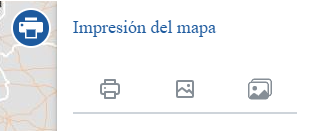
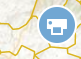

<p align="center">
  
</p>
<h1 align="center"><strong>API IDEE</strong> <small>🔌 IDEE.plugin.printviewmanagement</small></h1>

# Descripción

Plugin que permite utilizar diferentes herramientas de impresión.
- Impresión de imagen con plantilla personalizada.
- Impresión de imagen desde cliente.
- Impresión de imágenes de capas precargadas.
- Posibilidad de añadir fichero de georreferenciación (WLD).
- Posibilidad de indicar los DPI (dots per inches) de la imagen impresa.

|  Herramienta abierta  |Herramienta cerrada
|:----:|:----:|
|||

# Dependencias

Para que el plugin funcione correctamente es necesario importar las siguientes dependencias en el documento html:

Para uso de implementación OpenLayers:
- **printviewmanagement.ol.min.js**
- **printviewmanagement.ol.min.css**

Para uso de implementación Cesium:
- **printviewmanagement.cesium.min.js**
- **printviewmanagement.cesium.min.css**

```html
 <link href="https://componentes.idee.es/api-idee/plugins/printviewmanagement/printviewmanagement.ol.min.css" rel="stylesheet" />
 <script type="text/javascript" src="https://componentes.idee.es/api-idee/plugins/printviewmanagement/printviewmanagement.ol.min.js"></script>
```

# Uso del histórico de versiones

Existe un histórico de versiones de todos los plugins de API-IDEE en [api-idee-legacy](https://github.com/Desarrollos-IDEE/API-IDEE/tree/master/api-idee-legacy/plugins) para hacer uso de versiones anteriores.
Ejemplo:
```html
 <link href="https://componentes.idee.es/api-idee/plugins/printviewmanagement/printviewmanagement-1.0.0.ol.min.css" rel="stylesheet" />
 <script type="text/javascript" src="https://componentes.idee.es/api-idee/plugins/printviewmanagement/printviewmanagement-1.0.0.ol.min.js"></script>
```
Para poder utilizar una de las versiones, basta con indicar la versión en cada una de las dependencias:
<ul>
  <li>
    En caso de usar la versión 1.0:
    <ul>
      <li>printviewmanagement-1.0.0.ol.min.js</li>
      <li>printviewmanagement-1.0.0.ol.min.css</li>
    </ul>
  </li>
    
  <li>
    En caso de usar la versión 2.0:
    <ul>
      <li>printviewmanagement-2.0.0.ol.min.js</li>
      <li>printviewmanagement-2.0.0.ol.min.css</li>
    </ul>
  </li>
</ul>

# Parámetros

El constructor se inicializa con un JSON con los siguientes atributos:

- **position**:  Ubicación del plugin sobre el mapa.
  - 'left' (LEFT) - A la izquierda.
  - 'right' (RIGHT) - A la derecha.
- **collapsed**: Indica si el plugin viene colapsado de entrada (true/false). Por defecto: true.
- **collapsible**: Indica si el plugin puede abrirse y cerrarse (true) o si permanece siempre abierto (false). Por defecto: true.
- **order**: Determina la prioridad visual dentro del contenedor. Un valor más alto desplaza el botón hacia el final del flujo.
- **tooltip**: Texto que se muestra al dejar el ratón encima del plugin. Por defecto: Impresión del mapa.
- **isDraggable**: "True" para que el plugin se pueda desplazar, por defecto false.
- **useProxy**: Define si el plugin utilizará el proxy o no, valores true o false. Por defecto: false.
- **georefImageEpsg**: Indica si el control "Impresión de imágenes de capas precargadas" se añade al plugin (true/false). Por defecto: true.
  - **tooltip**: Texto que se muestra al dejar el ratón encima del plugin. Por defecto: Impresión del mapa.
  - **layers**: Array de objetos con información de las capas a imprimir.
    - url: URL de la capa.
    - name: Nombre de la capa.
    - format: Formato de la capa.
    - legend: Leyenda de la capa.
    - EPSG: Opcional, por defecto 3857.
  ```JavaScript
      layers: [
      {
                url: 'http://www.ign.es/wms-inspire/mapa-raster?',
                name: 'mtn_rasterizado',
                format: 'image/jpeg',
                legend: 'Mapa ETRS89 (long,lat)',
                EPSG: 'EPSG:4326',
              },
              {
                url: 'http://www.ign.es/wms-inspire/mapa-raster?',
                name: 'mtn_rasterizado',
                format: 'image/jpeg',
                legend: 'Mapa WGS84/Pseudo-Mercator',
                EPSG: 'EPSG:3857',
              },
              {
                url: 'http://www.ign.es/wms-inspire/mapa-raster?',
                name: 'mtn_rasterizado',
                format: 'image/jpeg',
                legend: 'Mapa ETRS89/UTM-31-N',
                EPSG: 'EPSG:25831',
              },
              {
                url: 'http://www.ign.es/wms-inspire/mapa-raster?',
                name: 'mtn_rasterizado',
                format: 'image/jpeg',
                legend: 'Mapa ETRS89/UTM-30-N',
                EPSG: 'EPSG:25830',
              },
              {
                url: 'http://www.ign.es/wms-inspire/mapa-raster?',
                name: 'mtn_rasterizado',
                format: 'image/jpeg',
                legend: 'Mapa ETRS89/UTM-29-N',
                EPSG: 'EPSG:25829',
              },
              {
                url: 'http://www.ign.es/wms-inspire/mapa-raster?',
                name: 'mtn_rasterizado',
                format: 'image/jpeg',
                legend: 'Mapa ETRS89/UTM-28-N',
                EPSG: 'EPSG:25828',
              },
    ],

  ```
  - **defaultDpiOptions**: Array de niveles de DPI a elegir por el usuario. Por defecto [72, 150, 300].
- **georefImage**: Indica si el control "Impresión de imagen (desde servidor o desde cliente)" se añade al plugin (true/false). Por defecto: true.
  - **tooltip**: Texto que se muestra al dejar el ratón encima del plugin. Por defecto: Impresión del mapa.
  - **printSelector**: Añade los dos modos de impresión (true/false). Por defecto: true.
  - **printType**: Define el modo de impresión (client/server), es necesario que printSelector tenga valor false.
  - **defaultDpiOptions**: Array de niveles de DPI a elegir por el usuario. Por defecto [72, 150, 300].
- **printermap**:  Indica si el control "Impresión de imagen con plantilla" se añade al plugin (true/false). Por defecto: true.
  - **tooltip**: Texto que se muestra al dejar el ratón encima del plugin. Por defecto: Impresión del mapa.
  - **filterTemplates**: Listado de rutas realtivas o absolutas de las cuales se obtendrán cada una de las plantillas a elegir en el modo de impresión. Por defecto:
  ```JavaScript
  "filterTemplates": [
    "https://componentes.idee.es/estaticos/plantillas/html/templateConBorde.html",
    "https://componentes.idee.es/estaticos/plantillas/html/templateConCabeceraYBorde.html",
    "https://componentes.idee.es/estaticos/plantillas/html/templateConFooterYBorde.html",
    ],
  ```
  - **defaultOpenControl**: Indica el control que aparecerá abierto al inicio. Por defecto: 0.
  - **showDefaultTemplate**: Si se quiere mostrar la opción de elegir la plantilla por defecto que tiene el plugin asignado. Por defecto: false.
  - **defaultDpiOptions**: Valores DPI a elegir en el modo de impresión. Por defecto 72, 150 y 300.
  - **layoutsRestraintFromDpi**: Plantillas en las que no se puede elegir el DPI debido al esfuerzo computaciona. Por defecto no se puede en A2, A1, A0 y tamaño pantalla.

# Uso de plantilla personalizada
Para crear una plantilla personalizada para el plugin de impresión, se deben de seguir estos pasos detallados para garantizar un diseño funcional y compatible:

1. **Formato del archivo**: La plantilla debe ser un archivo HTML. Se puede incluir estilos CSS mediante:
   - Estilos inline en las etiquetas HTML.
   - Hojas de estilo externas mediante la etiqueta `<link>`.
   - Estilos definidos dentro de una etiqueta `<style>` en el mismo archivo.

2. **Adaptación dinámica de estilos**: La creación de estilos CSS debe de tener en cuenta que los elementos de la plantilla deben adaptarse dinámicamente al contenedor principal según los elementos activos o inactivos. Asegúrarse de probar diferentes configuraciones para verificar la adaptabilidad de los elementos.

3. **Propiedades CSS no soportadas**: La librería de exportación html2canvas no admite ciertas propiedades CSS. Evitar usar las siguientes:
   - `background-blend-mode`
   - `border-image`
   - `box-decoration-break`
   - `box-shadow`
   - `filter`
   - `font-variant-ligatures`
   - `mix-blend-mode`
   - `object-fit`
   - `repeating-linear-gradient()`
   - `writing-mode`
   - `zoom`

4. **Identificación de elementos editables**: Para que el plugin reconozca los elementos que pueden activarse o desactivarse, debe de añadirse el atributo `data-type` a los elementos correspondientes. Este atributo debe tener uno de los siguientes valores:
   - `api-idee-template-titulo`
   - `api-idee-template-texto-libre`
   - `api-idee-template-leyenda`
   - `api-idee-template-flecha-norte`
   - `api-idee-template-escala`
   - `api-idee-template-borde`
   
   Ejemplo:
   ```html
   <div class="superior-container" data-type="api-idee-template-titulo">
   ```

   El elemento texto-libre es un elemento genérico, es decir, se puede introducir en la plantilla tantos elementos texto-libre como sea necesario. Para poder diferenciarlos, ademas del atributo `data-type`, es necesario añadirles el atributo `data-type-name`, el cual se usará internamente para diferenciar los elementos texto-libre. Este atributo puede tener el valor que se desee, aunque hay que tener precaución para que el valor no coincida con otro valor ya asignado a un atributo `data-type-name`.

5. **Uso de imágenes**: Evitar el formato SVG, ya que la librería html2canvas no lo soporta correctamente al exportar. Debe de utilizarse formatos como PNG, JPG o JPEG para las imágenes incluidas en la plantilla.

6. **Diseño de bordes**: Si se desea incluir un borde alrededor del mapa, asegurarse de crear un contenedor con el `id="imagen-mascara"`. Este contenedor es obligatorio, ya que el plugin insertará la previsualización del mapa dentro de él. Ejemplo:
  ```html
  <div class="interior-container" data-type="api-idee-template-borde">
      <div class="cell imagen-mascara" id="imagen-mascara"></div>
  </div>
  ```

7. **Contenedor principal**: El contenedor raíz de la plantilla debe tener el `id="api-idee-template-container"` para garantizar su correcto funcionamiento.
Ejemplo:
  ```html
  <div class="api-idee-template-container" id="api-idee-template-container">
  ```

### Ejemplo de elementos en una plantilla personalizada

A continuación, se muestran ejemplos de elementos correctamente configurados para la plantilla:

- **Elemento de tipo título**:
   ```html
   <div class="api-idee-template-container" id="api-idee-template-container">
       <div class="superior-container" data-type="api-idee-template-titulo">
           <div class="logo-left">
               
           </div>
           <div class="titulo-principal" contenteditable="true">Introduzca título</div>
           <div class="logo-right">
               
           </div>
       </div>
   </div>
   ```

- **Elemento de tipo borde**:
   ```html
   <div class="interior-container" data-type="api-idee-template-borde">
       <div class="cell"></div>
       <div class="cell">
           <div class="vertical-texts small-text small-top-text">
               <span class="left-text" id="top-left-coord"></span>
               <span class="right-text" id="top-right-coord"></span>
           </div>
       </div>
       <div class="cell"></div>
       <div class="cell small-text">
           <div class="horizontal-texts">
               <span class="left-text" id="left-top-coord"></span>
               <span class="right-text" id="left-bottom-coord"></span>
           </div>
       </div>
       <div class="cell imagen-mascara" id="imagen-mascara"></div>
       <div class="cell small-text">
           <div class="horizontal-texts">
               <span class="left-text" id="right-top-coord"></span>
               <span class="right-text" id="right-bottom-coord"></span>
           </div>
       </div>
       <div class="cell"></div>
       <div class="cell small-text">
           <div class="vertical-texts small-bottom-text">
               <span class="left-text" id="bottom-left-coord"></span>
               <span class="right-text" id="bottom-right-coord"></span>
           </div>
       </div>
       <div class="cell"></div>
   </div>
   ```

- **Elemento de tipo texto libre**:
   ```html
   <div class="inferior-container" data-type="api-idee-template-texto-libre">
       <div class="cell body-text" contenteditable="true">Introduzca descripción...</div>
       <div class="cell small-text">
           <div class="cell horizontal-texts cell-interior" id="current-date"></div>
           <div class="cell horizontal-texts cell-interior" id="map-epsg"></div>
       </div>
   </div>
   ```

# API-REST

```javascript
URL_API?printviewmanagement=position*collapsed*collapsible*tooltip*isDraggable*georefImageEpsg*georefImage*printermap*defaultOpenControl
```

<table>
  <tr>
    <th>Parámetros</th>
    <th>Opciones/Descripción</th>
    <th>Disponibilidad</th>
  </tr>
  <tr>
    <td>position</td>
    <td>RIGHT/LEFT</td>
    <td>Base64 ✔️ | Separador ✔️</td>
  </tr>
  <tr>
    <td>collapsed</td>
    <td>true/false</td>
    <td>Base64 ✔️ | Separador ✔️</td>
  </tr>
  <tr>
    <td>collapsible</td>
    <td>true/false</td>
    <td>Base64 ✔️ | Separador ✔️</td>
  </tr>
  <tr>
    <td>order</td>
    <td>Número entero positivo</td>
    <td>Base64 ✔️  | Separador ✔️ </td>
  </tr>
  <tr>
    <td>tooltip</td>
    <td>tooltip</td>
    <td>Base64 ✔️ | Separador ✔️</td>
  </tr>
  <tr>
    <td>isDraggable</td>
    <td>true/false</td>
    <td>Base64 ✔️ | Separador ✔️</td>
  </tr>
  <tr>
    <td>georefImageEpsg (*)</td>
    <td>true/false</td>
    <td>Base64 ✔️ | Separador ✔️</td>
  </tr>
  <tr>
    <td>georefImage (*)</td>
    <td>true/false</td>
    <td>Base64 ✔️ | Separador ✔️</td>
  </tr>
  <tr>
    <td>printermap (*)</td>
    <td>true/false</td>
    <td>Base64 ✔️ | Separador ✔️</td>
  </tr>
  <tr>
    <td>defaultOpenControl</td>
    <td>0, 1, 2, 3</td>
    <td>Base64 ✔️ | Separador ✔️</td>
  </tr>
</table>
(*) Este parámetro podrá ser enviado por API-REST con los valores true o false. Si es true indicará al plugin que se añada el control con los valores por defecto. Para añadir los zooms deseados en los que se podrá centrar el mapa se deberá realizar mediante API-REST en base64.

### Ejemplos de uso API-REST

```
https://componentes.idee.es/api-idee?printviewmanagement=LEFT*false*false*imprimir*true*true*true*true*2
```

```
https://componentes.idee.es/api-idee?printviewmanagement=LEFT*true*true*Imprimir*true***false*true*true*1
```


### Ejemplos de uso API-REST en base64

Para la codificación en base64 del objeto con los parámetros del plugin podemos hacer uso de la utilidad IDEE.utils.encodeBase64.
Ejemplo:
```javascript
IDEE.utils.encodeBase64(obj_params);
```

1) Ejemplo de constructor del plugin:

```javascript
{
  isDraggable: true,
  position: 'left',
  collapsible: true,
  collapsed: true,
  order: 0,
  tooltip: 'Imprimir',
  georefImageEpsg: {
    tooltip: 'Georeferenciar imagen',
    layers: [
      {
        url: 'http://www.ign.es/wms-inspire/mapa-raster?',
        name: 'mtn_rasterizado',
        format: 'image/jpeg',
        legend: 'Mapa ETRS89 UTM',
        EPSG: 'EPSG:4326',
      },
      {
        url: 'http://www.ign.es/wms-inspire/pnoa-ma?',
        name: 'OI.OrthoimageCoverage',
        format: 'image/jpeg',
        legend: 'Imagen (PNOA) ETRS89 UTM',
      },
    ],
    defaultDpiOptions: [72, 150, 300],
  },
  georefImage: {
    tooltip: 'Georeferenciar imagen',
    printSelector: true,
    defaultDpiOptions: [72, 150, 300],
  },
  printermap: true,
  defaultOpenControl: 3
}
```
```
https://componentes.idee.es/api-idee?printviewmanagement=base64=eyJpc0RyYWdnYWJsZSI6dHJ1ZSwicG9zaXRpb24iOiJUTCIsImNvbGxhcHNpYmxlIjp0cnVlLCJjb2xsYXBzZWQiOnRydWUsInRvb2x0aXAiOiJJbXByaW1pciIsImdlb3JlZkltYWdlRXBzZyI6eyJ0b29sdGlwIjoiR2VvcmVmZXJlbmNpYXIgaW1hZ2VuIiwibGF5ZXJzIjpbeyJ1cmwiOiJodHRwOi8vd3d3Lmlnbi5lcy93bXMtaW5zcGlyZS9tYXBhLXJhc3Rlcj8iLCJuYW1lIjoibXRuX3Jhc3Rlcml6YWRvIiwiZm9ybWF0IjoiaW1hZ2UvanBlZyIsImxlZ2VuZCI6Ik1hcGEgRVRSUzg5IFVUTSIsIkVQU0ciOiJFUFNHOjQzMjYifSx7InVybCI6Imh0dHA6Ly93d3cuaWduLmVzL3dtcy1pbnNwaXJlL3Bub2EtbWE/IiwibmFtZSI6Ik9JLk9ydGhvaW1hZ2VDb3ZlcmFnZSIsImZvcm1hdCI6ImltYWdlL2pwZWciLCJsZWdlbmQiOiJJbWFnZW4gKFBOT0EpIEVUUlM4OSBVVE0ifV19LCJnZW9yZWZJbWFnZSI6eyJ0b29sdGlwIjoiR2VvcmVmZXJlbmNpYXIgaW1hZ2VuIiwicHJpbnRUZW1wbGF0ZVVybCI6Imh0dHBzOi8vY29tcG9uZW50ZXMuY25pZy5lcy9nZW9wcmludC9wcmludC9tYXBleHBvcnQiLCJwcmludFNlbGVjdG9yIjp0cnVlfSwicHJpbnRlcm1hcCI6dHJ1ZSwiZGVmYXVsdE9wZW5Db250cm9sIjozfQ==
```


2) Ejemplo de constructor del plugin:
```javascript
{
  isDraggable: true,
  position: 'left',
  collapsible: true,
  collapsed: true,
  order: 0,
  tooltip: 'Imprimir',
  georefImageEpsg: false,
  georefImage: false,
  printermap: true
}
```
```
https://componentes.idee.es/api-idee?printviewmanagement=base64=eyJpc0RyYWdnYWJsZSI6dHJ1ZSwicG9zaXRpb24iOiJUTCIsImNvbGxhcHNpYmxlIjp0cnVlLCJjb2xsYXBzZWQiOnRydWUsInRvb2x0aXAiOiJJbXByaW1pciIsImdlb3JlZkltYWdlRXBzZyI6ZmFsc2UsImdlb3JlZkltYWdlIjpmYWxzZSwicHJpbnRlcm1hcCI6dHJ1ZX0=
```

# Ejemplo de uso

```javascript
const map = IDEE.map({
  container: 'map'
});

const mp = new IDEE.plugin.PrintViewManagement({
  isDraggable: true,
  position: 'left',
  collapsible: true,
  collapsed: true,
  order: 0,
  tooltip: 'Imprimir',
  defaultOpenControl: 3,
  georefImageEpsg: {
    tooltip: 'Georeferenciar imagen',
    layers: [
      {
        url: 'http://www.ign.es/wms-inspire/mapa-raster?',
        name: 'mtn_rasterizado',
        format: 'image/jpeg',
        legend: 'Mapa ETRS89 UTM',
        EPSG: 'EPSG:4326',
      },
      {
        url: 'http://www.ign.es/wms-inspire/pnoa-ma?',
        name: 'OI.OrthoimageCoverage',
        format: 'image/jpeg',
        legend: 'Imagen (PNOA) ETRS89 UTM',
        // EPSG: 'EPSG:4258',
      },
    ],
    defaultDpiOptions: [72, 150, 300],
  },
  georefImage: {
    tooltip: 'Georeferenciar imagen',
    printSelector: false,
    printType: 'client',
    defaultDpiOptions: [72, 150, 300],
  },
  printermap: {
    filterTemplates: [
      "https://componentes.idee.es/estaticos/plantillas/html/templateConBorde.html",
      "https://componentes.idee.es/estaticos/plantillas/html/templateConCabeceraYBorde.html",
      "https://componentes.idee.es/estaticos/plantillas/html/templateConFooterYBorde.html",
    ],
    showDefaultTemplate: true,
    defaultDpiOptions: [72, 150, 300],
    layoutsRestraintFromDpi: ['screensize', 'A0', 'A1', 'A2'],
  },
});

map.addPlugin(mp);

```


# 👨‍💻 Desarrollo

Para el stack de desarrollo de este componente se ha utilizado

* NodeJS Version: 14.16
* NPM Version: 6.14.11
* Entorno Windows.

## 📐 Configuración del stack de desarrollo / *Work setup*


### 🐑 Clonar el repositorio / *Cloning repository*

Para descargar el repositorio en otro equipo lo clonamos:

```bash
git clone [URL del repositorio]
```

### 1️⃣ Instalación de dependencias / *Install Dependencies*

```bash
npm i
```

### 2️⃣ Arranque del servidor de desarrollo / *Run Application*

```bash
npm start:ol
npm start:cesium
```

## 📂 Estructura del código / *Code scaffolding*

```any
/
├── src 📦                  # Código fuente
├── task 📁                 # EndPoints
├── test 📁                 # Testing
├── webpack-config 📁       # Webpack configs
└── ...
```
## 📌 Metodologías y pautas de desarrollo / *Methodologies and Guidelines*

Metodologías y herramientas usadas en el proyecto para garantizar el Quality Assurance Code (QAC)

* ESLint
  * [NPM ESLint](https://www.npmjs.com/package/eslint) \
  * [NPM ESLint | Airbnb](https://www.npmjs.com/package/eslint-config-airbnb)

## ⛽️ Revisión e instalación de dependencias / *Review and Update Dependencies*

Para la revisión y actualización de las dependencias de los paquetes npm es necesario instalar de manera global el paquete/ módulo "npm-check-updates".

```bash
# Install and Run
$npm i -g npm-check-updates
$ncu
```

## Tabla de compatibilidad de versiones   
[Consulta el api resourcePlugin](https://componentes.idee.es/api-idee/api/actions/resourcesPlugins?name=printviewmanagement)