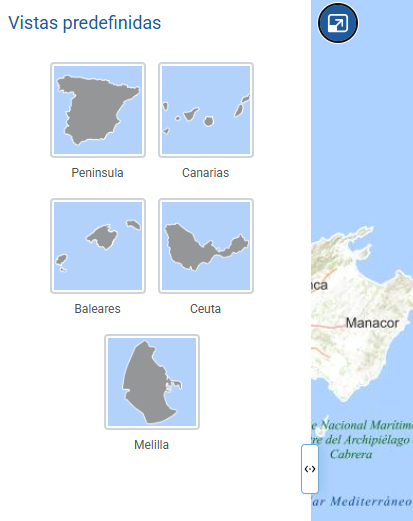

# IDEE.plugin.selectionzoom

Plugin que permite la elección del área geográfica de la capa de fondo. Existen varias vistas predefinidas disponibles.

|  Herramienta abierta  |Herramienta cerrada
|:----:|:----:|
|||

# Dependencias

Para que el plugin funcione correctamente es necesario importar las siguientes dependencias en el documento html:

Para uso de implementación OpenLayers:
- **selectionzoom.ol.min.js**
- **selectionzoom.ol.min.css**

Para uso de implementación Cesium:
- **selectionzoom.cesium.min.js**
- **selectionzoom.cesium.min.css**

```html
 <link href="https://componentes.idee.es/api-idee/plugins/selectionzoom/selectionzoom.ol.min.css" rel="stylesheet" />
 <script type="text/javascript" src="https://componentes.idee.es/api-idee/plugins/selectionzoom/selectionzoom.ol.min.js"></script>
```

# Uso del histórico de versiones

Existe un histórico de versiones de todos los plugins de API-IDEE en [api-idee-legacy](https://github.com/Desarrollos-IDEE/API-IDEE/tree/master/api-idee-legacy/plugins) para hacer uso de versiones anteriores.
Ejemplo:
```html
 <link href="https://componentes.idee.es/api-idee/plugins/selectionzoom/selectionzoom-1.0.0.ol.min.css" rel="stylesheet" />
 <script type="text/javascript" src="https://componentes.idee.es/api-idee/plugins/selectionzoom/selectionzoom-1.0.0.ol.min.js"></script>
```

# Parámetros

El constructor se inicializa con un JSON de options con los siguientes atributos:

- **position**:  Ubicación del plugin sobre el mapa.
  - 'left' (LEFT) - A la izquierda.
  - 'right' (RIGHT) - A la derecha.
- **collapsed**: Indica si el plugin viene colapsado de entrada (true/false). Por defecto: true.
- **collapsible**: Indica si el plugin puede abrirse y cerrarse (true) o si permanece siempre abierto (false). Por defecto: true.
- **order**: Determina la prioridad visual dentro del contenedor. Un valor más alto desplaza el botón hacia el final del flujo.
- **tooltip**: Texto que se muestra al dejar el ratón encima del plugin. Por defecto: Vistas predefinidas.
- **options**: Lista con las opciones de las capas.
  - **id**: Identificador de la capa
  - **title**: Nombre identificativo de la capa que se mostrará sobre la previsualización.
  - **preview**: Ruta a la imagen de previsualización que se muestra.
  - **bbox**: Bbox de la zona geografica a la que se hace zoom. El bbox debe recoger los datos en la misma proyección en la que se encuentra el mapa.
  - **zoom**: Zoom que toma la capa en la zona geográfica elegida. Para poder usar el zoom también debe tener valor el parámetro center. Se obviará si el parámetro bbox tiene valor.
  - **center**: Punto central que toma la capa en la zona geográfica elegida. Para poder usar el punto central también debe tener valor el parámetro zoom. Se obviará si el parámetro bbox tiene valor.

# Ejemplo de uso

```javascript
   const map = IDEE.map({
     container: 'map'
   });

   const mp = new IDEE.plugin.SelectionZoom({
    position: 'left',
    collapsible: true,
    collapsed: true,
    order: 1,
    options: [
      {
        id: 'peninsula',
        title: 'Peninsula',
        preview: 'https://componentes.ign.es///plugins/selectionzoom/images/espana.png',
        bbox: '-1200091.444315327, 365338.89496508264, 4348955.797933925, 5441088.058207252'
      },
      {
        id: 'canarias',
        title: 'Canarias',
        preview: 'https://componentes.ign.es///plugins/selectionzoom/images/canarias.png',
        center: '-1844272.618465, 3228700.074766',
        zoom: 8
      }
    ]
    });

   map.addPlugin(mp);
```

## Tabla de compatibilidad de versiones   
[Consulta el api resourcePlugin](https://componentes.idee.es/api-idee/api/actions/resourcesPlugins?name=selectionzoom)