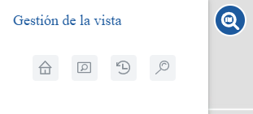

<p align="center">
  
</p>
<h1 align="center"><strong>API IDEE</strong> <small>🔌 IDEE.plugin.ViewManagement</small></h1>

# Descripción

Plugin que permite utilizar diferentes herramientas de zoom.
- Centrar el mapa la(s) vista(s) indicada(s) por parámetro.
- Realizar zoom con una caja sobre el mapa.
- Navegar entre las vistas visitadas del mapa (hacia delante y atrás).
- Acercar o alejar a una vista del mapa.

|  Herramienta abierta  |Herramienta cerrada
|:----:|:----:|
|||

# Dependencias

Para que el plugin funcione correctamente es necesario importar las siguientes dependencias en el documento html:
Para uso de implementación OpenLayers:
- **viewmanagement.ol.min.js**
- **viewmanagement.ol.min.css**

Para uso de implementación Cesium:
- **viewmanagement.cesium.min.js**
- **viewmanagement.cesium.min.css**

```html
 <link href="https://componentes.idee.es/api-idee/plugins/viewmanagement/viewmanagement.ol.min.css" rel="stylesheet" />
 <script type="text/javascript" src="https://componentes.idee.es/api-idee/plugins/viewmanagement/viewmanagement.ol.min.js"></script>
```

# Uso del histórico de versiones

Existe un histórico de versiones de todos los plugins de API-IDEE en [api-idee-legacy](https://github.com/Desarrollos-IDEE/API-IDEE/tree/master/api-idee-legacy/plugins) para hacer uso de versiones anteriores.
Ejemplo:
```html
 <link href="https://componentes.idee.es/api-idee/plugins/viewmanagement/viewmanagement-1.0.0.ol.min.css" rel="stylesheet" />
 <script type="text/javascript" src="https://componentes.idee.es/api-idee/plugins/viewmanagement/viewmanagement-1.0.0.ol.min.js"></script>
```

# Parámetros

El constructor se inicializa con un JSON con los siguientes atributos:

- **position**:  Ubicación del plugin sobre el mapa.
  - 'left' (LEFT) - A la izquierda.
  - 'right' (RIGHT) - A la derecha.
- **collapsed**: Indica si el plugin viene colapsado de entrada (true/false). Por defecto: true.
- **collapsible**: Indica si el plugin puede abrirse y cerrarse (true) o si permanece siempre abierto (false). Por defecto: true.
- **order**: Determina la prioridad visual dentro del contenedor. Un valor más alto desplaza el botón hacia el final del flujo.
- **tooltip**: Texto que se muestra al dejar el ratón encima del plugin. Por defecto: Gestión de la vista.
- **isDraggable**: Permite mover el plugin por el mapa. Por defecto: false.
- **predefinedZoom**: Indica si el control PredefinedZoom se añade al plugin (true/false). Por defecto: true (zoom a España). Para añadir los zooms deseados en los que se podrá centrar el mapa se seguirá el siguiente formato:
  ```javascript
  predefinedZoom: [{
    name: 'Zoom1',
    bbox: [-2392173.2372, 3033021.2824, 1966571.8637, 6806768.1648],
  },
  {
    name: 'Zoom2',
    center: [-428106.86611520057, 4334472.25393817],
    zoom: 4,
  }]
  ```
  (Válido sólo para la creación del plugin por JS y API-REST en base64).
- **zoomExtent**: Indica si el control ZoomExtent se añade al plugin (true/false). Por defecto: true.
- **viewhistory**: Indica si el control ViewHistory se añade al plugin (true/false). Por defecto: true.
- **zoompanel**: Indica si el control ZoomPanel se añade al plugin (true/false). Por defecto: true.

# API-REST

```javascript
URL_API?viewmanagement=position*collapsed*collapsible*tooltip*isDraggable*predefinedZoom*zoomExtent*viewhistory*zoompanel
```

<table>
  <tr>
    <th>Parámetros</th>
    <th>Opciones/Descripción</th>
    <th>Disponibilidad</th>
  </tr>
  <tr>
    <td>position</td>
    <td>RIGHT/LEFT</td>
    <td>Base64 ✔️ | Separador ✔️</td>
  </tr>
  <tr>
    <td>collapsible</td>
    <td>true/false</td>
    <td>Base64 ✔️ | Separador ✔️</td>
  </tr>
  <tr>
    <td>collapsed</td>
    <td>true/false</td>
    <td>Base64 ✔️ | Separador ✔️</td>
  </tr>
  <tr>
    <td>order</td>
    <td>Número entero positivo</td>
    <td>Base64 ✔️  | Separador ✔️ </td>
  </tr>
  <tr>
    <td>tooltip</td>
    <td>tooltip</td>
    <td>Base64 ✔️ | Separador ✔️</td>
  </tr>
  <tr>
    <td>isDraggable</td>
    <td>true/false</td>
    <td>Base64 ✔️ | Separador ✔️</td>
  </tr>
  <tr>
    <td>predefinedZoom (*)</td>
    <td>true/false</td>
    <td>Base64 ✔️ | Separador ✔️</td>
  </tr>
  <tr>
    <td>zoomExtent</td>
    <td>true/false</td>
    <td>Base64 ✔️ | Separador ✔️</td>
  </tr>
  <tr>
    <td>viewhistory</td>
    <td>true/false</td>
    <td>Base64 ✔️ | Separador ✔️</td>
  </tr>
  <tr>
    <td>zoompanel</td>
    <td>true/false</td>
    <td>Base64 ✔️ | Separador ✔️</td>
  </tr>
</table>
(*) Este parámetro podrá ser enviado por API-REST con los valores true o false. Si es true indicará al plugin que se añada el control con los valores por defecto. Para añadir los zooms deseados en los que se podrá centrar el mapa se deberá realizar mediante API-REST en base64.

### Ejemplos de uso API-REST

```
https://componentes.idee.es/api-idee/?viewmanagement=TL*true*true*tooltip
```

```
https://componentes.idee.es/api-idee/?viewmanagement=TL*true*true*tooltip*true*false*true*true*false
```

### Ejemplos de uso API-REST en base64

Para la codificación en base64 del objeto con los parámetros del plugin podemos hacer uso de la utilidad IDEE.utils.encodeBase64.
Ejemplo:
```javascript
IDEE.utils.encodeBase64(obj_params);
```

1) Ejemplo de constructor del plugin:

```javascript
{
  position:'TL',
  collapsible: true,
  collapsed: true,
  tooltip: 'Gestión de la vista',
  predefinedZoom: true,
  zoomExtent: false,
  viewhistory: true,
  zoompanel: true,
}
```
```
https://componentes.idee.es/api-idee/?viewmanagement=base64=eyJwb3NpdGlvbiI6IlRMIiwiY29sbGFwc2libGUiOnRydWUsImNvbGxhcHNlZCI6dHJ1ZSwidG9vbHRpcCI6Ikdlc3Rpw7NuIGRlIGxhIHZpc3RhIiwicHJlZGVmaW5lZFpvb20iOnRydWUsInpvb21FeHRlbnQiOmZhbHNlLCJ2aWV3aGlzdG9yeSI6dHJ1ZSwiem9vbXBhbmVsIjp0cnVlfQ==
```


2) Ejemplo de constructor del plugin:
```javascript
{
  position:'TL',
  tooltip: 'Gestión de la vista',
  predefinedZoom: [
    {name: 'zoom 1', center: [-428106.86611520057, 4334472.25393817], zoom: 4},
    {name: 'zoom 2', bbox: [-2392173.2372, 3033021.2824, 1966571.8637, 6806768.1648]}]
}
```
```
https://componentes.idee.es/api-idee/?viewmanagement=base64=eyJwb3NpdGlvbiI6IlRMIiwidG9vbHRpcCI6Ikdlc3Rpw7NuIGRlIGxhIHZpc3RhIiwicHJlZGVmaW5lZFpvb20iOlt7Im5hbWUiOiJ6b29tIDEiLCJjZW50ZXIiOlstNDI4MTA2Ljg2NjExNTIwMDU3LDQzMzQ0NzIuMjUzOTM4MTddLCJ6b29tIjo0fSx7Im5hbWUiOiJ6b29tIDIiLCJiYm94IjpbLTIzOTIxNzMuMjM3MiwzMDMzMDIxLjI4MjQsMTk2NjU3MS44NjM3LDY4MDY3NjguMTY0OF19XX0=
```

# Ejemplo de uso

```javascript
const map = IDEE.map({
  container: 'map'
});

const mp = new IDEE.plugin.ViewManagement({
  position: 'TL',
  collapsible: true,
  collapsed: true,
  predefinedZoom: [{
    name: 'zoom 1',
    center: [-428106.86611520057, 4334472.25393817],
    zoom: 4,
  },
  {
    name: 'zoom 2',
    bbox: [-2392173.2372, 3033021.2824, 1966571.8637, 6806768.1648],
  }],
  zoomExtent: true,
  viewhistory: false,
  zoompanel: true,
  isDraggable: false,
});

map.addPlugin(mp);
```


# 👨‍💻 Desarrollo

Para el stack de desarrollo de este componente se ha utilizado

* NodeJS Version: 14.16
* NPM Version: 6.14.11
* Entorno Windows.

## 📐 Configuración del stack de desarrollo / *Work setup*


### 🐑 Clonar el repositorio / *Cloning repository*

Para descargar el repositorio en otro equipo lo clonamos:

```bash
git clone [URL del repositorio]
```

### 1️⃣ Instalación de dependencias / *Install Dependencies*

```bash
npm i
```

### 2️⃣ Arranque del servidor de desarrollo / *Run Application*

```bash
npm start:ol
npm start:cesium
```

## 📂 Estructura del código / *Code scaffolding*

```any
/
├── src 📦                  # Código fuente
├── task 📁                 # EndPoints
├── test 📁                 # Testing
├── webpack-config 📁       # Webpack configs
└── ...
```
## 📌 Metodologías y pautas de desarrollo / *Methodologies and Guidelines*

Metodologías y herramientas usadas en el proyecto para garantizar el Quality Assurance Code (QAC)

* ESLint
  * [NPM ESLint](https://www.npmjs.com/package/eslint) \
  * [NPM ESLint | Airbnb](https://www.npmjs.com/package/eslint-config-airbnb)

## ⛽️ Revisión e instalación de dependencias / *Review and Update Dependencies*

Para la revisión y actualización de las dependencias de los paquetes npm es necesario instalar de manera global el paquete/ módulo "npm-check-updates".

```bash
# Install and Run
$npm i -g npm-check-updates
$ncu
```

## Tabla de compatibilidad de versiones   
[Consulta el api resourcePlugin](https://componentes.idee.es/api-idee/api/actions/resourcesPlugins?name=viewmanagement)